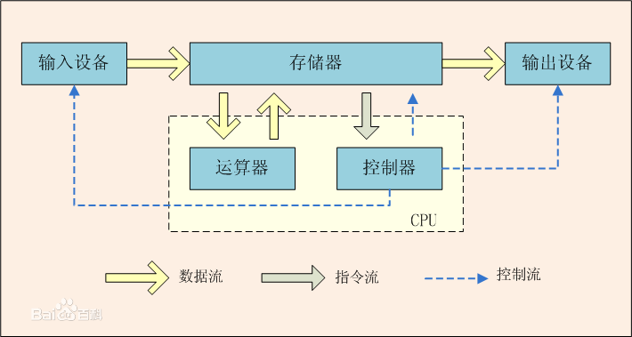

# Arch Linux配置&Linux使用教程

目录：


[TOC]

### 1.简介

​		本配置教程根据个人安装经验整合编写，用来帮助想要入门Arch Linux的用户快速上手Arch Linux的配置过程并尽快的掌握一些可能算是必须的相关知识点以及技能并了解部分的操作系统运行原理，包含从 arch linux 安装，KDE 桌面环境安装，到 Linux 显卡驱动，魔法上网，常用软件，日常维护以及部分Linux相关知识，部分内容存在个人主观观点，此外，此文档参考并引用了部分网络上的现有教程代码以及当前的Arch Wiki内容（更新于2021年5月12日)

### 2.安装前的准备——镜像烧录

##### 		2.1 原Windows用户

​		原windows用户推荐使用rufus软件进行Arch镜像的烧录，官网:https://rufus.ie/zh_CN.html

​			注：当前最新版不会提醒您是否使用dd模式写入镜像，但较老的版本可能存在这种情况，若出现该类提示时选择以dd模式写入，否则烧录完的镜像无法正					常使用！bash

##### 		2.2 原Linux用户

​		原Linux用户可使用Balena Etcher进行Arch镜像的烧录，亦可使用指令进行烧录操作，操作指令为

```bash
sudo dd bs=4M if=/path/to/archlinux.iso of=/dev/sdx status=progress oflag=sync
```

​		命令解释：

​			`提权指令 调用dd命令 设置文件输入输出块大小为4M 指定镜像目录 指定烧录设备地址 输出刻录过程总的信息 保证数据真正写入了U盘 `

​		虚拟机用户请忽略

### 3.进入安装环境前的准备

##### 	3.1原windows用户

​		以下内容虚拟机用户请忽略

​		3.1.1在BIOS中关闭Secure Boot功能

​			Secure Boot用来限制主板的启动，它会禁止主板从未经认证的操作系统或硬件驱动程序的加载，以此来防止恶意软件的入侵，但因为这种特性，导致了操作系统的垄断（即若想启动一个系统则该主板上必须要有对应的公钥），如果想要启动非Windows系统则很可能需要关闭主板上的该功能

​		3.1.2调整启动方式为UEFI

​			在某些旧的主板里，需要调整启动模式为 UEFI,而非传统的 BIOS/CSM。在类似名为 boot 的选项卡中，找到类似名为 Boot Mode 的选项，确保将其调整为UEFI，而非 legacy/CSM

​		3.1.3关闭windows的快速启动功能

​			快速启动是 Windows 8 (及更新的版本) 中的一项功能,通过休眠来提高启动速度.但是如果你休眠 Windows 然后进入另一个系统修改文件,可能会造成数据丢失.即使你不打算在双系统中共享文件,这也容易损坏 EFI 系统分区.因此你应该在安装前禁用快速启动

​		3.3.4 确定硬盘分配（想双系统的用户注意！！！）

​			由于安装需要使用一部分磁盘空间（整个分区），因此，您需要查看您的设备分区状态，准备好一整块的分区便于以后使用（当前部分电脑是单C盘使用，因此需要考虑拆分分区的操作，一般情况下借助windows自带的计算机管理中的磁盘管理就可以轻松的执行该步骤）

##### 	3.2原Linux用户

​			如果是的话应该可以直接跳过该环节了～～

##### 	3.3不管你是什么用户

​			想要从U盘启动的方式主要有两种，从启动选项菜单中选择（临时）或直接修改BIOS的设置（永久），部分电脑为默认优先从U盘启动

​			虚拟机用户请忽略。。。

### 4.开始安装过程

​			此时你应该进入了arch的安装环境了，选择第一项或第二项均可（第二项会在环境准备就绪时说一段话），请注意，在一些场合下，您可以使用TAB键实现命令的自动补全，以此来减少打字次数节省时间并降低错误率，此外，安装环境默认的文本编辑器为VIM,需掌握VIM的基本操作，以下为需要掌握的VIM的操作示例：

| 功能           | 操作方式                                          |
| -------------- | ------------------------------------------------- |
| 剪切           | 非编辑模式下连续输入2次d                          |
| 粘贴           | 非编辑模式下输入1次p                              |
| 进入编辑模式   | 输入i                                             |
| 退出编辑模式   | 按下ESC键                                         |
| 顺向查找       | 非编辑模式下输入 / 后加上需要查找的文本内容后回车 |
| 反向查找       | 非编辑模式下输入 ? 后加上需要查找的文本内容后回车 |
| 保存并退出     | 输入:wq后回车                                     |
| 不保存直接退出 | 输入:q！后回车                                    |
| 回到第一行     | 非编辑模式下连按2次g                              |
| 跳转到文末     | 非编辑模式下按下shift和g                          |

然后让我们开始安装流程

##### 	4.1确认当前的引导模式为UEFI

```bash
ls /sys/firmware/efi/efivars
```

​		若执行后有输出内容即当前为UEFI模式，若没有该输出请尝试重新执行3.1.2的内容

##### 	4.2连接网络

​		若您是使用有线连接网络，您可以跳过该步骤，进行4.3的内容，若您是无线连接，请利用以下指令进行网络连接

```bash
iwctl                           #进入交互式命令行
device list                     #列出设备名，比如无线网卡看到叫 wlan0
station wlan0 scan              #扫描网络
station wlan0 get-networks      #列出网络 比如想连接CMCC-5AQ7这个无线
station wlan0 connect wlanNAME  #进行连接 输入密码即可
exit                            #成功后exit退出
#一般情况下，您可以直接执行iwctl和station wlan0 connect wlanNAME即可连接，输入exit退出即可
```

##### 	4.3确认网络连接状态

​		直接使用ping命令用于测试即可，

```bash
ping www.bilibili.com
```

​		有返回类似`64 比特，来自 ecs-119-3-234-165.compute.hwclouds-dns.com (119.3.234.165): icmp_seq=4 ttl=42 时间=24.6 毫秒`的内容即代表网络连接正常，按下Ctrl + c 终止ping命令即可，如果无法连接，使用 `ip link set xxx up` 命令确认你已经激活了对应的网卡，再重新执行ping命令，若有类似Operation not possible due to RF-kill的报错，继续尝试`rfkill unblock wifi`来解锁无线网卡

##### 	4.4禁用reflector

​		 reflector 服务用于自动更新 mirrorlist，在特定情况下，它可能会误删源信息，导致在国内无法访问软件源，这将强迫你再次手动修改源配置文件

```bash
systemctl stop reflector.service
```

##### 	4.5进行时间同步

```bash
timedatectl set-ntp true    #将系统时间与网络时间进行同步
timedatectl status          #检查服务状态
```

​		若有类似以下返回即代表时间服务正常

```bash
               Local time: 二 2021-03-23 22:22:41 CST
           Universal time: 二 2021-03-23 14:22:41 UTC
                 RTC time: 二 2021-03-23 14:22:41    
                Time zone: Asia/Shanghai (CST, +0800)
System clock synchronized: yes                       
              NTP service: active                    
          RTC in local TZ: no      
```

##### 	4.6更换国内镜像源

```bash
vim /etc/pacman.d/mirrorlist
```

​		执行完毕后您会进入VIM编辑器，在里面利用查找功能快速定位到china部分，选择您想使用的源将其剪切粘贴到所有的镜像源的最前面（此文件中的链接是世界各地的源，pacman会按照该源内的顺序从上而下的尝试直到该源可用，更多相关信息可以自行阅读该文件内的注释部分）

##### 	4.7分区

###### 				4.7.1 打算换到纯Arch的用户或拥有专门的硬盘安装Arch的用户

​		因为分区需求每个人都可能不同，因此给出以下下部分Linux目录表以便于您自行定义

| 目录 |                 说明                 | 是否推荐独立分区 | 推荐大小 |       标签        | 备注(独立分区的好处是能在系统崩溃时保证某一部分的正常，缺点是ext4格式无法后期修改大小，而若不使用ext4格式可能会出现兼容问题) |
| :--: | :----------------------------------: | :--------------: | :------: | :---------------: | :----------------------------------------------------------- |
| EFI  |             开机引导目录             |       推荐       |  800MB   |    EFI System     | 请将该分区作为第一个分区，以防不兼容的问题发生，             |
|  /   |                根目录                |  没得选，必须是  |   100G   | linux file system | 防治所以文件的地方，是最底层的目录，若您不打算将home独立分区，那么跟目录就是越大越好 |
| swap | 交换分区，将部分内存数据保存到硬盘上 |        是        |  4～8G   |    linux swap     | swap为可有可无的分区，推荐开启，否则可能在运行部分软件时出现异常或因内存不足出现异常，或无法使用系统休眠功能 |
| home |                家目录                |        是        | 越大越好 |    linux home     | 存放您的个人数据的地方，独立分区可以保证以后系统崩溃时不会损坏您的个人文件 |
| opt  |          第三方软件安装目录          |        否        |   80G    | linux file system | 大小取决于您想要安装的软件的大小，可视情况而定，若您将此独立分区，您就可以将/的大小适当减小 |
| tmp  |           存放临时文件目录           |        否        |    8G    | linux file system | 部分软件因为会产生大量的垃圾文件可能会导致占用大量根目录空间，若此类情况发生可考虑将其独立分区 |
| usr  |           应用程序放置目录           |        否        |   80G    | linux /usr x86-64 | 大小取决于您想要安装的软件的大小，可视情况而定，若您将此独立分区，您就可以将/的大小适当减小 |

​		**linux的部分设备命名规则**

​		在linux系统中，您的所有设备都将以文件的形式放在/dev文件夹中，在不同的场景下通过挂载相应设备来使用它们，以硬盘为例，您的硬盘会以adx或nvmexnx的文件形式存在，下表为命名规则（以下内容均会使用sdax来演示）

|              | adx类                                                        | nvmexnx类                                                    |
| ------------ | ------------------------------------------------------------ | ------------------------------------------------------------ |
| 硬盘命名规则 | SCSI/SATA/U盘会以adx的形式存在，x表示从a到p的字母，通过排序表示设备，如一个U盘的文件为sdb | nvme设备会以nvmexnx的形式存储，第一个x表示插槽命名空间，第二个x表示位置，如某个硬盘为nvme0n1 |
| 分区命名规则 | adx的分区命名规则为在后面加一个数字，如某设备的第一个分区为sda1 | nvmexnx的分区命名规则为在后面添加px（x为数字），如某设备的第一个分区为nvme0n1p1 |

在执行lsblk时，您将会看到类似如下的返回信息：

`NAME       MAJ:MIN  RM   SIZE RO TYPE  MOUNTPOINT 
loop0    	   7:0    0  547.9M  1 loop  /var/xdroid/common/rootfs 
sda      	   8:0    0  111.8G  0 disk  
└─sda1       8:1    0  111.8G  0 part  /run/timeshift/backup 
nvme1n1   	  259:0   0  476.9G  0 disk  
├─nvme1n1p1 259:2   0  260M  	 0 part  
├─nvme1n1p2 259:3   0  16M  	 0 part  
├─nvme1n1p3 259:4   0  457.9G  0 part  /run/media/stvsl/OS 
├─nvme1n1p4 259:5   0  1.3G    0 part  
└─nvme1n1p5 259:6   0  17.5G   0 part  
nvme0n1   	  259:1   0  465.8G  0 disk  
├─nvme0n1p1 259:7   0  800M    0 part  
├─nvme0n1p2 259:8   0   8G  	 0 part  [SWAP] 
└─nvme0n1p3 259:9   0  457G    0 part  /
 `

###### 				4.7.2 Windows与Linux双系统用户

​		原windows用户请注意！不要执行parted相关的命令！！！这可能会损坏您的windows系统！！！

​		原windows用户请注意！不要执行parted相关的命令！！！这可能会损坏您的windows系统！！！

​		原windows用户请注意！不要执行parted相关的命令！！！这可能会损坏您的windows系统！！！

​		重要的事情说三遍！！！

​		此外，您可能需要额外另建一个EFI分区(尽管原来已经有了)用来引导双系统	

###### 				4.7.3 虚拟机用户

​		虚拟机请随意，与4.7.1基本一致

###### 		4.7.4 分区操作命令使用方法演示

​	（以cfdisk为例，当然，您也可以使用fdisk,gdisk等工具）

```bash
lsblk                       #显示分区情况，这会显示您当前的硬盘设备的基本信息，您可以根据size的大小大致判断是您的哪一块硬盘parted /dev/sdx             #执行parted，进行磁盘类型变更(parted)mktableNew disk label type? gpt    #输入gpt 将磁盘类型转换为gpt 如磁盘有数据会警告，输入yes即可quit                        #最后quit退出parted命令行交互cfdisk  /dev/sdx            #执行分区操作,分配各个分区大小，类型#请注意，该步骤需要选择Linux分区类型标签（type），标签按照对应分区类型选择fdisk -l                    #复查磁盘情况
```

##### 4.8格式化新分区

​		以下仅为部分命令，其它分区命令与之类似

```bash
#磁盘原来若有数据会返回 'proceed any way?' 输入y回车即可mkfs.ext4  /dev/sdax            #格式化根目录，home目录等分区，当然，您也可以使用其他的分区格式，但这可能导致未知异常的发生！！！mkfs.vfat  /dev/sdax            #格式化efi分区mkswap -f /dev/sdax             #格式化swap分区swapon /dev/sdax                #打开swap分区
```

​		注意：双系统用户仅需要格式化新的几个分区，其它的原有分区不要操作！！！

#####  4.9挂载分区

​		注意！！！挂载时为保证目录树正常，请从根目录`/mnt`开始挂载

```bash
#挂载根目录mount /dev/sdax  /mnt#挂载efi文件目录mkdir /mnt/efimount /dev/sdax /mnt/efi#挂载其它目录（以home目录为例，其它目录亦同）mkdir /mnt/homemount /dev/sdax /mnt/home
```

##### 4.10安装系统

###### 	4.10.1基础包安装

```bash
pacstrap /mnt base linux linux-firmware
```

​		若您想要使用AUR或使用系统的一些基础工具的话请额外安装 `base-devel` ！！！即 `pacstrap /mnt base base-devel linux linux-firmware` ,不安装可能会极大的降低您的使用体验！！！

###### 	4.10.2 功能性包安装

```bash
pacstrap /mnt dhcpcd iwd vim sudo bash-completion   #dhcped用于获取动态IP地址 iwd用于无线网络连接 vim为文本编辑器  sudo为必备提权工具 bash-completion是命令补全工具，若您不喜欢vim,换成nano也可以
```

##### 4.11生成fstab文件

​		fstab是用于存放文件系统的静态信息，位于/etc/目录下，当系统启动的时候，系统会从这个文件读取信息，并且会自动将此文件中指定的文件系统挂载到指定的目录，以下为自动生成命令

```
genfstab -U /mnt >> /mnt/etc/fstab
```

​		复查fstab以防有误

```
cat /mnt/etc/fstab
```

​		若异常您可以尝试再次执行生成命令，或[手动修改fstab](https://blog.csdn.net/richerg85/article/details/17917129)

##### 4.12切换环境到新系统内

```bash
arch-chroot /mnt
```

##### 4.13设置主机名（local hosts）

​		此步骤可以先行跳过，不进行也可以，若后期出现进入桌面且联网后无法正常打开任何软件时回过头来执行即可（但那样你需要在命令前加上sudo）

​		首先在/etc/hostname设置主机名

```bash
vim /etc/hostname #若您使用的是nano则将vim换成nano
```

​		向文件中写入您将要使用的用户名后保存退出

​		随后修改/etc/hosts

```bash
vim /etc/hosts #若您使用的是nano则将vim换成nano
```

​		向文件中输入以下内容

```bash
127.0.0.1    localhost::1          localhost127.0.1.1    your.localdomain yourname
```

##### 4.14设置时区与同步硬件时间

​		国内使用上海，其它地区请按照您的需求修改

```bash
ln -sf /usr/share/zoneinfo/Asia/Shanghai /etc/localtime
```

​		同步硬件时间

```bash
hwclock --systohc
```

##### 4.15设置地区信息

​		此步需修改/etc/locale.gen

```bash
vim /etc/locale.gen #若您使用的是nano则将vim换成nano
```

​		此步您需要查找并去掉 en_US.UTF-8 以及 zh_CN.UTF-8 两行前面的注释符号#

​		随后执行以下命令生成locate

```bash
locale-gen
```

​		然后向/etc/locale.conf输入以下内容（直接执行即可）

```bash
echo 'LANG=en_US.UTF-8'  > /etc/locale.conf
```

​		然后查看该更改是否已生效

```bash
vim /etc/locale.conf #若文件内有LANG=en_US.UTF-8即代表已生效
```

##### 4.16 设置root账户的密码

```bash
passwd root
```

##### 4.17安装微码

​		微码用于纠正CPU运行时可能产生的错误以及对部分底层指令引入新特性和优化，安装哪个微码完全取决于你的CPU型号

```bash
pacman -S intel-ucode   #Intel CPU安装pacman -S amd-ucode     #AMD CPU安装
```

##### 4.18安装与配置引导程序GRUB

```bash
pacman -S grub efibootmgr   #grub是启动引导器，efibootmgr被 grub 脚本用来将启动项写入 NVRAMgrub-install --target=x86_64-efi --efi-directory=/efi --bootloader-id=Arch-GRUB #取名为Arch-GRUB 并将grubx64.efi安装到的指定位置grub-mkconfig -o /boot/grub/grub.cfg #自动生成GRUB配置文件
```

！！！请注意！！！

windows双系统用户请先安装ntfs-3g使系统支持加载NTFS文件系统的分区，否则GRUB无法识别到WIndows系统！！！

```bash
yay -S ntfs-3g
```

​		部分主板在4.19执行完毕后可能出现问题，因为其不支持自定义EFI,而导致您无法找到Arch-GRUB的启动选项，此时您需要重新插回U盘执行4.9，4.12，随后执行以下命令

```bash
mkdir -p /efi/EFI/BOOTmv /efi/EFI/GRUB/grubx64.efi /efi/EFI/BOOT/BOOTX64.EFI
```

##### 4.19退出安装

```bash
exit                # 退回安装环境umount -R  /mnt     # 卸载分区reboot              # 重启
```

### 5.安装桌面环境和部分系统配置

​	如果你顺利的进入了一个黑不溜秋的东西里面那么恭喜，你成功了50%了！接下来开始配置剩下的部分

##### 5.1连接网络

​	有线连接网络请执行以下命令开启动态IP地址分配

```bash
systemctl start dhcpcd
```

​	无线连接请额外执行以下命令（4.2的内容）

```bash
iwctl                           #进入交互式命令行device list                     #列出设备名，比如无线网卡看到叫 wlan0station wlan0 scan              #扫描网络station wlan0 get-networks      #列出网络 比如想连接CMCC-5AQ7这个无线station wlan0 connect wlanNAME  #进行连接 输入密码即可exit                            #成功后exit退出#一般情况下，您可以直接执行iwctl和station wlan0 connect wlanNAME即可连接，输入exit退出即可
```

​	测试网络连接是否正常(4.3的内容)

```bash
ping www.bilibili.com
```

##### 5.2更新系统

```bash
pacman -Syyu 										#有时可能有包的冲突，如果有类似报错且你不怕死的话可以执行 pacman -Syyu
```

##### 5.3准备日常使用账户

​	创建账户

```bash
useradd -m -G wheel -s /bin/bash yourname  			#wheel附加组可sudo进行提权 -m同时创建用户家目录，yourname请替换成4.13步骤里面设置的名字！！！
```

​	设置密码

```bash
passwd yourname 		#yourname请替换成4.13步骤里面设置的名字！！!
```

##### 5.34配置sudo

```bash
EDITOR=vim visudo 		#若您使用的是nano则将vim换成nano
```

​	查找 `#%wheel ALL=(ALL) ALL`的所在行，去除前面的注释符号#后保存退出即可

##### 5.5安装KDE桌面环境

```bash
pacman -S plasma-meta
```

##### 5.6安装终端与文件管理器

```bash
pacman -S konsole dolphin 
```

##### 5.7开启SDDM服务

```bash
systemctl enable sddm
```

##### 5.8开启32位源与archlinuxcn源

```bash
vim /etc/pacman.conf 	 #若您使用的是nano则将vim换成nano
```

去掉[multilib]一节中两行的注释，来开启 32 位库支持。
在文档结尾处加入下面的文字，来开启 ArchLinuxCN 源（此处使用中科大的软件源，若您不喜欢或想要换其它源可以自行[点击此处查看选择](https://github.com/archlinuxcn/mirrorlist-repo)）

```bash
[archlinuxcn]Server = https://mirrors.ustc.edu.cn/archlinuxcn/$arch
```

##### 5.9刷新pacman数据库

```bash
pacman -Syyu
```

##### 5.10重启进入桌面环境

```bash
reboot
```

### 6.进入桌面后的准备

​	恭喜你成功装好了桌面，接下来让我们配置最后的一点东西吧！

##### 6.1网络连接

​	现在已经有桌面环境了，因此我们可以使用KDE的网络管理器而不是使用和dhcped和iwd来连接网络了！

```bash
sudo systemctl disable iwd                             #确保iwd开机处于关闭状态，其无线连接会与NetworkManager冲突sudo systemctl stop iwd                                #同上，立即关闭iwdsudo systemctl start --now NetworkManager              #开启NetworkManagersudo systemctl enable --now NetworkManager             #设置NetworkManager开机自启动，并进行网络连接
```

##### 6.2安装并应用中文字体和表情包支持

```bash
 sudo pacman -S wqy-bitmapfont wqy-microhei wqy-zenhei adobe-source-code-pro-fonts adobe-source-sans-pro-fonts adobe-source-serif-pro-fonts adobe-source-han-sans-cn-fonts ttf-monaco ttf-dejavu ttf-hanazono noto-fonts noto-fonts-cjk noto-fonts-emoji
```

​	打开 System Settings > Regional Settings > Language 中选择中文后再拖拽到第一位点击apply完成设置，重启就能看到中文啦！！！

##### 6.3 配置AUR

​	AUR可以说是Arch的一大特色了，它是一个用户维护的社区源，允许用户上传提交软件，因此可以利用AUR安装大量软件，为了愉快使用AUR,我们需要安装AUR软件包管理器yay

```bash
sudo pacman -S archlinuxcn-keyringsudo pacman -S yay  yay --aururl "https://aur.tuna.tsinghua.edu.cn" --save  	#修改yay的镜像源
```

​	注：若安装archlinuxcn-keyring时报错，您需要暂时进入root下执行以下命令

```bash
su 									#进入root权限状态pacman -Syu havegedsystemctl start havegedsystemctl enable havegedrm -fr /etc/pacman.d/gnupgpacman-key --initpacman-key --populate archlinuxpacman-key --populate archlinuxcn
```

​	执行成功后，输入exit退出root模式然后重新执行即可

​	yay的指令与pacman的指令基本一致，但有所不同，以下为常使用的pacman的指令表

| 命令                 | 功能                         |
| -------------------- | ---------------------------- |
| `sudo pacman  -S`    | 安装软件包                   |
| `sudo pacman -Ss`    | 搜索软件包                   |
| `sudo pacman -U`     | 安装本地软件包               |
| `sudo pacman -Syyu`  | 更新软件源与软件             |
| `sudo pacman -Syyuu` | 强制更新（慎用）             |
| `sudo pacman -R`     | 删除软件包                   |
| `sudo pacman -Rs`    | 删除软件包以及与之相关的依赖 |
| `sudo pacman -Sc`    | 删除未安装的软件包缓存       |
| `sudo pacman -Scc`   | 删除所有的软件包缓存         |
| `sudo pacman -Qdt`   | 找出孤儿包（无人维护的包）   |
| `sudo pacman -F`     | 查找某指令的来源包           |

​	yay的指令与之基本一致但要注意，pacman要求必须使用sudo提权或使用root权限下运行，而yay强烈反对，yay'会默认以普通权限运行，在安装某些软件时才会向用户主动申请root权限，此外 `yay -Ss ` 可以直接简写成更加完善强大的 `yay ` (一个小吐槽：yay -Ss那么长的命令竟然没有yay强大？？？)

##### 6.4安装中文输入法

​	需要中文的场合一定是有的，所以接下来开始安装中文输入法，以下内容以安装小企鹅输入法（fcitx5）为例

​	安装输入法本体

```bash
sudo pacman -S fcitx5-im 				#基础包组sudo pacman -S fcitx5-chinese-addons 	#中文输入引擎
```

​	配置输入法环境变量

```bash
sudo vim ~/.pam_environment				 #若您使用的是nano则将vim换成nano
```

​	向其中加入以下内容

```bash
INPUT_METHOD DEFAULT=fcitx5GTK_IM_MODULE DEFAULT=fcitx5QT_IM_MODULE DEFAULT=fcitx5XMODIFIERS DEFAULT=\@im=fcitx5SDL_IM_MODULE DEFAULT=fcitx
```

​	然后打开 *系统设置* > *区域设置* > *输入法*，点击*添加输入法*，找到简体中文下的 Pinyin ，点击添加，找到 *配置附加组件* 拉到下面找到 *Pinyin* 点选`云拼音`和`在程序中显示预编辑文本` 应用，然后重启即可愉快的输入中文了！

安装输入法词库（提升打字效率和准确率）

```bash
sudo pacman -S fcitx5-pinyin-moegirl	#萌娘百科词库yay -S fcitx5-pinyin-zhwiki				#维基百科词库
```

​	因为每个人对输入法的使用感受不同，因此给出[官方wiki文档](https://wiki.archlinux.org/index.php/Fcitx5_(%E7%AE%80%E4%BD%93%E4%B8%AD%E6%96%87)#%E6%8B%BC%E9%9F%B3%E8%BE%93%E5%85%A5%E6%B3%95)，您可以根据此文档进行更进一步的个性化设置

##### 6.5 安装一些可能必备的软件

​	有了强大到无法想象的yay,就可以开始肆无忌惮的安装各种软件了，以下是可能必备的软件（但您也可以选择不安装它们，只不过可能会影响到效率）

| 软件名         | 功能                             | 备注                                                       | 安装指令                                                     |
| -------------- | -------------------------------- | ---------------------------------------------------------- | ------------------------------------------------------------ |
| 火狐浏览器     | 浏览器                           | 还算可以，可以三选一                                       | `sudo pacman -S firefox`                                     |
| chromium浏览器 | 浏览器                           | 经典传奇，可以三选一                                       | `sudo pacman -S chromium`                                    |
| edge浏览器     | 浏览器                           | 强烈推荐，可以三选一                                       | `yay -S microsoft-edge-dev-bin`                              |
| ark            | 压缩软件                         | 与kde配合使用及其强大                                      | `sudo pacman -S ark`                                         |
| gwenview       | 图片查看器                       | 体验一般，不过和kde配合使用挺强大的                        | `sudo pacman -S gwenview`                                    |
| ntfs-3g        | 识别和读写微软的ntfs格式分区支持 | 如果想要愉快使用系统，最好还算装上吧                       | `sudo pacman -S ntfs-3g`                                     |
| kdeconnect     | 连接手机提供一些有用的功能       | 基本是必备                                                 | `sudo pacman -S kdeconnect`                                  |
| vlc            | 多媒体播放器                     | 强大                                                       | `sudo pacman -S vlc`                                         |
| mpv            | 多媒体播放器                     | 还行                                                       | `sudo pacman -S mpv`                                         |
| wps            | 金山wps办公套装                  | 基本上是必备的了吧？                                       | `yay -S wps-office ttf-wps-fonts wps-office-mui-zh-cn`       |
| libreoffice    | 自由免费全能跨平台的办公套件     | 不过和office还是有兼容问题还很明显                         | `sudo pacman -S libreoffice-fresh`  #尝鲜版 <br>`sudo pacman -S libreoffice-still` #稳定版 |
| spectacle      | 截图软件                         | 和KDE配合挺高效，但是不是特别好用                          | `sudo pacman -S spectacle`                                   |
| flameshot      | 截图软件                         | 强大，好用，但是需要部分手动设置                           | `sudo pacman -S flameshot`                                   |
| pamac          | 软件包管理程序                   | 可以想成yay的图形界面版，不过有时会有一些奇怪的BUG         | `sudo pacman -S pamac`                                       |
| discover       | KDE的软件商店                    | discover已在系统中预安装，但无法正常工作，因此给出解决方案 | `sudo pacman -S packagekit-qt5`                              |
| timeshift      | 系统备份工具                     | 极其重要，因为你永远不知道你的系统会因为什么而崩溃         | `sudo pacman -S timeshift`                                   |
| Yakuake        | 终端工具                         | 超级推荐！！！,设置F12快速唤醒                             | `sudo pacman -S Yakuake`                                     |

### 7.显卡驱动

​	这一步很容易翻车！！！，请利用上面给的timeshift先备份系统再进行操作

##### 	7.1 AMD核显&独显

​	AMD直接使用开源驱动即可

##### 	7.2 Intel核显

```bash
sudo pacman -S mesa lib32-mesa vulkan-intel lib32-vulkan-intel 	# Intel HD 4000 及以上的核显才支持vulkan，低于此型号的不要装lib32-vulkan-intel
```

##### 	7.3 Nvidia独显

```bash
sudo pacman -S nvidia nvidia-settings lib32-nvidia-utils 		#必须安装
```

​	 GeForce 630 以下到 GeForce 400

```bash
yay -S nvidia-390xx-dkms nvidia-settings lib32-nvidia-390xx-utils
```

​	上古显卡（使用开源驱动）

```bash
sudo pacman -S mesa lib32-mesa xf86-video-nouveau
```

##### 7.4 Nvidia独显与独显混合（笔记本）

​	先安装驱动

```bash
sudo pacman -S nvidia nvidia-prime nvidia-settings nvidia-utils opencl-nvidia lib32-nvidia-utils lib32-opencl-nvidia
```

​	安装显卡切换方案（以下使用optimus方案）

​	先给出[官方文档](https://wiki.archlinux.org/index.php/NVIDIA_Optimus) 和 [optimus官方文档](https://github.com/Askannz/optimus-manager/wiki) 

```bash
yay -S optimus-manager optimus-manager-qt
```

​	设置开机自启

```bash
sudo systemctl enable optimus-manager
```

​	以下是注意事项

- 在切换显卡时请关闭GPU监控类插件或程序，它们会阻止显卡切换，导致未知错误

- 不要使用 Nvidia Control Panel 中的Save to X Configuration file按钮，会导致配置冲突

- 在显卡之间的切换时，重新登陆后如在 splash screen 卡住或者黑屏，可以尝试在 tty1 tty2 之间进行切换

- 修改optimus-manager的设置时请确认您的设备支持该功能，以防未知情况的发生

- 若不幸翻车，您可以在开机时按下`ctrl`+`shift`+`F2`进入tty2，登陆后卸载安装的所有新安装的显卡驱动，或使用timeshift进行系统还原，正常进入桌面后可重新尝试安装

- 若您想使用optimus-manager内的动态切换模式（hybrid模式），想要以显卡启动漠哥程序时请请先进行以下操作：

  1. 使用`prime-run `前缀启动程序

  2. 若想要使用全局模式请先设置环境变量

     ```bash
     sudo vim /etc/environment		 #若您使用的是nano则将vim换成nano
     ```

     向文末添加以下内容后保存退出即可

     ```bash
     __NV_PRIME_RENDER_OFFLOAD=1__GLX_VENDOR_LIBRARY_NAME="nvidia"__VK_LAYER_NV_optimus="NVIDIA_only"
     ```

     3.若您想从动态切换模式切换到其他模式，请先删除上述环境变量！！！否则将造成黑屏

- 使用大黄蜂管理方案（降低特定场合下的功耗延长电池寿命与使用时间）（不建议使用，有时会发生不兼容问题导致黑屏！！！）

```bash
sudo pacman -S bbswitch
```

​		随后在optimus-manager内选择该模式即可

### 8.安装配置结束

​	如果顺利的走到这里，那么恭喜，您已经安装成功了，可以尽情探索了！接下来的内容将是系统美化，日常软件推荐，特殊软件的安装和部分特殊需求的实现还有日常系统维护以及基本的Linux知识点，首先先讲一下系统维护吧！

​	系统维护做重要的无疑就是一点：因为Arch属于滚动更新的系统，因此养成每日更新系统的好习惯是必不可少的，建议每次开机以后先执行一次(对于滚动更新的系统这点是必须的！！！，若更新后发生影响正常使用的系统异常，请先查看[arch的新闻列表](https://archlinux.org/news/))

```bash
sudo pacman -Syyu
```

或是执行（推荐）

```bash
yay -Syyu
```

### 9.系统美化

​	系统美化可能是最没有标准答案的部分了，因为每个人的使用逻辑和喜欢的界面样式都不同，因此以下内容仅列出相关个性化设置的设置方式和部分推荐

##### 9.1系统主题

​	对于最新版的KDE而言，个性化设置已经被高度集中了，绝大多数设置均在`系统设置` > `外观` 内，因此，您可以在其中寻找您喜欢的内容，以下仅为个人推荐（半MAC风格）

| 版块         | 推荐内容         |
| ------------ | ---------------- |
| 全局主题     | WhiteSur-dark    |
| 应用程序风格 | Breeze微风       |
| Plasma样式   | WhiteSur-dark    |
| 窗口装饰元素 | WhiteSur         |
| 颜色         | WhiteSur         |
| 图标         | Breeze微风暗色   |
| 光标         | WhiteSur Cursors |
| 欢迎屏幕     | Snowy Night Miku |

##### 9.2 SDDM主题设置

​	当前版本KDE将SDDM设置放在`系统设置` > `开机与关机` >`登陆屏幕（SDDM）`内，个人推荐内容为Sugar Candy

##### 9.3 桌面设置

​	在桌面点击鼠标右键，点击`配置桌面和壁纸`即可，本部分无推荐，若您想使用动态壁纸，请点击`获取新插件`搜索`Smart vidio wallplayer`

​		注：该插件使用了gstreamer plugins组件用来播放视频，因此，还需要额外安装gstreamer plugins软件包

```bash
yay -S gstreamer0.10-base-plugins gstreamer0.10-base-plugins lib32-gst-plugins-good lib32-gst-plugins-base-libs lib32-gst-plugins-base
```

##### 9.4桌面插件推荐

​	官方预装插件此处不进行推荐（但有的是真的好用），请自行体验

| 名称            | 介绍                     |
| --------------- | ------------------------ |
| Translater      | 翻译插件                 |
| Netspeed widget | 文本网速显示             |
| todolist        | 事件清单                 |
| Event Calender  | 极其强大的时钟部件替代品 |

##### 9.5混成器设置

​	`系统设置`>` 显卡与显示器` >` 混成器` >`开机时启用显示特效混合器`渲染模式选择OpenGL 3.1或OpenGL 2.0（OpenGL3.1会在部分较老的型号上发生异常）

##### 9.6终端效果配置

​	此处不介绍ZSH的美化配置，仅做简单配置介绍

​	透明化背景及模糊效果：

​	打开Konsole终端，右键，点击`外观`，选择一个喜欢的配置方案，点击`编辑`，打开`模糊背景`，拉动`背景透明度`到60%点击确定后关闭即可

##### 9.7Krunner居中

​	Krunner可以说是一个极其好用的工具，可以实现快速搜索快速打开等操作，而它默认是显示在屏幕上方（部分人可能不喜欢这样的设计，比如说我），因此将其放到屏幕中间，设置也很简单

​		`系统设置`>`搜索`>`KRunner`>`屏幕上的位置`，将其改为居中即可

##### 9.8Yakuake配置（请确保您已安装Yakuake）

​	按下F12唤醒Yakuake，点击设置图标，点击`配置Yakuake` > `外观` > `获取新皮肤`，搜索`breeze-minimal`安装并应用即可（当然，您也可以自行进行选择）

到此，基本的系统美化工作结束

### 10.日常软件推荐

​	毕竟系统不是装着摆着玩的以下是各类日常软件的推荐

##### 10.1音乐软件

| 软件名       | 备注                              | 安装指令                             |
| ------------ | --------------------------------- | ------------------------------------ |
| QQ音乐       |                                   | `yay -S qqmusic-bin`                 |
| 网易云音乐   | 不支持小企鹅（fcitx5）输入法      | `sudo pacman -S netease-cloud-music` |
| YesPlayMusic | 不错的第三方网易云音乐,使用JS编写 | `yay -S YesPlayMusic`                |

##### 10.2即时通讯软件

| 软件名           | 备注                                                     | 安装指令                                                     |
| ---------------- | -------------------------------------------------------- | ------------------------------------------------------------ |
| QQ-IM（wine）    |                                                          | `yay -S com.qq.im.deepin`                                    |
| TIM（wine）      | 强烈建议切换到deepinwine后使用！！！                     | `yay -S deepin-wine-tim`<br>切换到deepin-wine5<br/>`/opt/apps/com.qq.office.deepin/files/run.sh -d`<br>若字体大小异常，请执行<br>`/opt/apps/com.qq.office.deepin/files/run.sh winecfg` |
| QQ轻聊版（wine） |                                                          | `yay -S deepin.com.qq.im.light`                              |
| 微信（wine）     | 强烈建议切换到deepinwine后使用！！！                     | `yay -S deepin-wine-wechat`<br>切换到deepin-wine5<br>`/opt/apps/com.qq.weixin.deepin/files/run.sh -d`<br>若字体大小异常，请执行<br/>`/opt/apps/com.qq.weixin.deepin/files/run.sh winecfg` |
| Linux QQ         | 垃圾                                                     | `yay -S linuxqq`                                             |
| 微信-UOS         | 官方网页套壳的垃圾                                       | `yay -S wechat-uos`                                          |
| 钉钉             | 一般，直播功能不完善（可能无法正常发起直播或调用摄像头） | `yay -S deepin.com.dingtalk.com`                             |
| 电报             | 全球流行的即时通信软件                                   | `sudo pacman -S telegram-desktop`                            |

##### 10.3远程协助

| 软件名     | 备注 | 安装指令                                                     |
| ---------- | ---- | ------------------------------------------------------------ |
| teamviewer |      | `yay -S teamviewer`                                          |
| 向日葵     |      | `yay -S sunloginclient<br>运行前请先执行`<br>`systemctl start runsunloginclient.service` |
| anydesk    |      | `yay -S anydesk-bin`                                         |

##### 10.4 网盘与下载

| 软件名    | 备注                                                         | 安装指令                      |
| --------- | ------------------------------------------------------------ | ----------------------------- |
| 百度网盘  | 慢到离谱                                                     | `yay - S baidunetdisk-bin`    |
| 迅雷      | 可以，但是在KDE下存在无法直接使用窗口管理器<br>直接关闭的BUG,需要在任务栏上面手动关闭来退出 | `yay -S xunlei-bin`           |
| FDM       | 还好                                                         | `yay - S freedownloadmanager` |
| filezilla | 没用过                                                       | `sudo pacman -S filezilla`    |
| aria2     | OK                                                           | `sudo pacman -S aria2`        |

### 11.专业软件

##### 	11.1 开发软件

​		自行使用yay搜索吧！应该大多数需要的都有（VS那种严重依赖平台的没有）

##### 	11.2 媒体工作软件

| 软件名       | 备注                                                         | 安装指令                                                     |
| ------------ | ------------------------------------------------------------ | ------------------------------------------------------------ |
| GIMP         | 图像处理                                                     | `sudo pacman -S gimp`                                        |
| krita        | 画图                                                         | `yay -S krita`                                               |
| inkscape     | 画矢量图                                                     | `yay -S inkscape`                                            |
| blender      | 3D建模                                                       | `sudo pacman -S blender`                                     |
| LMMS         | 音频制作                                                     | `sudo pacman -S lmms`                                        |
| Kdenlive     | 视频剪辑                                                     | `sudo pacman -S  kdenlive`                                   |
| shotcut      | 视频剪辑                                                     | `sudo pacman -S  shotcut`                                    |
| mkvtoolnix   | mkv格式制作和处理的工具                                      | `sudo pacman -S  mkvtoolnix`                                 |
| 达芬奇       | 非常NB的视频处理，建议有Nvidia显卡的使用，否则。。。很可能无法正常运行，运行时请保证当前显卡是被开启的 | `yay -S davinci-resolve`<br>安装时会报错，这时请前往davinci官网下载对应版本，放到您家<br>目录中的`.cache/yay/davinci-resolve/`然后执行`cd .cache/yay/davinci-resolve/ `<br>然后执行 `makepkg -i` 进行打包安装 |
| 达芬奇studio | 比非常NB还NB的视频处理，建议有Nvidia显卡的使用，否则。。。很可能无法正常运行，运行时请保证当前显卡是被开启的 | `yay -S davinci-resolve-studio`<br/>安装时会报错，这时请前往davinci官网下载对应版本，放到您家<br/>目录中的`.cache/yay/davinci-resolve-studio/`然后执行`cd .cache/yay/davinci-resolve-studio/`<br/>然后执行 `makepkg -i` 进行打包安装 |
| OBS          | 不解释，不过不支持大部分插件了QAQ（但部分插件可通过aur安装） | `yay -S obs-studio`                                          |

##### 	11.3 虚拟机以及虚拟化

​	在一定的特殊场合下，您可能会有各种奇怪的需求，比如运行一些只有windows能干的事（像是用VS的那种）在此时，你可能就会想到再运行一个系统等等，而此时，虚拟机就帮上了大忙，再要求更高的场合下，虚拟化更是必须，因此下面将给出安装虚拟机VMware和KVM-Qemu虚拟化的配置方案

###### 		11.3.1VMware安装

​		安装很简单，一句话的问题

```bash
sudo pacman -S vmware-workstation
```

​		需要注意的是，初次使用时可能提示NAT网桥无法使用，很可能会出现会提示网络异常，此时执行以下命令即可

```bash
sudo systemctl restart vmware-networks  #重启vmware网络sudo systemctl enable vmware-networks	#设置vmware网络开机自启动（仅当经常使用VM虚拟机时使用）
```

​		此外，若您想使用VMware来开启本地的实体机系统的话，请使用`sudo vmware`来启动（但这也存在着更多的风险）

###### 		11.3.2 KVM-Qemu虚拟化的配置

- KVM(Kernel-based Virtual Machine, 即内核级虚拟机) 是一个开源的系统虚拟化模块，QEMU是个独立的虚拟化解决方案，从这个角度它并不依赖KVM。而KVM是另一套虚拟化解决方案，不过因为这个方案实际上只实现了内核中对处理器（Intel VT, AMD SVM)虚拟化特性的支持，换言之，它缺乏设备虚拟化以及相应的用户空间管理虚拟机的工具，所以它借用了QEMU的代码并加以精简，连同KVM一起构成了另一个独立的虚拟化解决方案：KVM + QEMU

- 有关KVM-Qemu虚拟机的配置的内容极多，因此只给出最简单的配置，详细配置请参考[官方KVM文档](https://wiki.archlinux.org/index.php/KVM_(%E7%AE%80%E4%BD%93%E4%B8%AD%E6%96%87))和[官方Qemu文档](https://wiki.archlinux.org/index.php/QEMU_(%E7%AE%80%E4%BD%93%E4%B8%AD%E6%96%87))

  1. 检查系统虚拟化功能是否开启（或是否支持）

     ```bash
     LC_ALL=C lscpu | grep Virtualization
     ```

     若有返回结果即代表当前状态下系统支持虚拟化

  2. 开始安装KVM以及KVM相关组件

     ```bash
      pacman -S qemu libvirt ovmf virt-manager
     ```

  3. 开启lib-virt的服务

     ```bash
     systemctl start libvirtdsystemctl enable libvirtd		#若经常使用可以选择运行此项
     ```

  4. 将当前用户加入KVM组

     ```bash
     sudo usermod -a -G kvm yourname #yourname请替换成4.13步骤里面设置的名字！！！
     ```

  5. 当你第一次使用KVM虚拟机时，很可能会提示NAT网络无法连接，此时，可以从终端尝试启动NAT网络服务

     ```bash
     sudo virsh net-start defaultsudo virsh net-autostart default
     ```

     若执行过程中报错，你可以查看报错信息若报错信息为`错误：internal error: Failed to initialize a valid firewall backend`，那么可以大致判断问题的发生原因是因为安装KVM虚拟机时系统依赖管理器发生异常导致，需要重新安装iptables、dnsmasq和ebtables即

     ```bash
     sudo pacman -S ebtables iptables dnsmasq
     ```

     随后重启KVM网络管理器

     ```bash
     sudo sudo systemctl restart libvirtd
     ```

     最后重新尝试开启NAT网络服务

     ```bash
     sudo virsh net-start default
     ```

###### 11.3.3linux中的虚拟化以及docker虚拟化技术简介

- chroot

  在前面的安装过程中，有一个步骤就是是chroot的高级封装版，使用的命令为`arch-chroot /mnt`，用于将当前终端环境切换到新的新的系统内，即重新指定当前的根目录位置，此步骤调用了linux中的一个简易的隔离系统`chroot`，chroot系统调用可以提供一种较为简单的系统隔离方式，chroot内部的文件系统无法访问外部的内容与命令，这也是为什么在执行此步骤前前需要先在外部将所必需的包安装完毕而不是直接切换进入再进行安装的原因（即利用文件目录的权限分级原理，越高目录中的文件拥有的权限越低，而根目录是Linux中最底层的文件目录，因此，切换根目录位置将会导致权限结构发生变化，当根目录被切换到比它高的目录中后，它就无法访问比此目录更低层的目录了）

- linux下的命名空间（Linux Namespace）

  Linux Namespace可以在系统中提供一个内核级别的各维度环境隔离的方案，它在在类比chroot运行方式的基础上在另外六个维度上提供了隔离机制，分别为Mount、UTS、IPC、PID、Network、User，每个命名空间的目的是将一个特定的全局系统资源包装在一个抽象中，使得它在命名空间内的进程看来它们拥有自己独立的全局资源实例，以下是详细介绍

  1. Mount namespace:
     对应系统调用参数：CLONE_NEWNS

     Mount 是最先被实现的命名空间，作为第一个命名空间，他的系统调用参数也是很直接，clone new namespace。研发人员在当时可能没有预期到命名空间的数量会持续扩张

     挂载命名空间隔离了一组进程看到的文件系统挂载点集。因此，不同安装命名空间中的进程可以具有文件系统层次结构的不同视图。通过添加mount命名空间，mount()和umount()系统调用将停止在系统上所有进程可见的全局挂载点集上运行，而是执行仅影响与调用进程关联的挂载命名空间的操作

  2. IPC namespace:
     对应系统调用参数：CLONE_NEWIPC

     IPC全称 Inter-Process Communication，IPC有共享内存、信号量、消息队列等方法。为了使同一命名空间下的进程可以正常通讯不受干扰，使用IPC namespace实现通讯隔离

  3. UTS namespace:
     对应系统调用参数：CLONE_NEWUTS

     UTS名字派生自传递给uname系统调用的结构名称"struct ustname"

     其主要通过sethostname()与setdomainnae()系统调用完成hostname与domainname的隔离。在使用二者进行项目初始化或者配置脚本时，UTS隔离会显得非常必要

  4. PID namespace:
     对应系统调用参数：CLONE_NEWPID

     隔离进程Id号空间。即不同PID名称空间中的进程可以具有相同的PID。PID命名空间的主要优点之一是容器可以在主机之间迁移，同时为容器内的进程保留相同的进程ID。PID命名空间还允许每个容器具有自己的 init（PID 1），即管理各种系统初始化任务的“所有进程的祖先”，并在终止时收获孤立的子进程

     从特定PID名称空间实例的角度来看，进程有两个PID：名称空间内的PID，以及主机系统上名称空间外的PID。PID命名空间可以嵌套：一个进程将为层次结构的每个层提供一个PID，从它所驻留的PID命名空间开始到根PID命名空间。进程可以看到仅包含在其自己的PID名称空间中的进程以及嵌套在该PID名称空间下方的名称空间，例如，通过/proc/<PID>查看并使用kill()发送信号

  5. User namespace:
     对应系统调用参数：CLONE_NEWUSER

     隔离用户和组ID号空间。换句话说，进程的用户和组ID在用户命名空间的内部和外部可以是不同的。这里最有趣的情况是进程可以在用户命名空间外具有普通的非特权用户ID，同时在命名空间内具有用户ID 0，这意味着该进程对用户命名空间内的操作具有完全root权限，但对于命名空间外的操作没有特权

     从Linux 3.8开始，非特权进程可以创建用户命名空间，这为应用程序开辟了一系列有趣的新可能性：由于非特权进程可以在用户命名空间内保存root权限，因此非特权应用程序现在可以访问以前仅限于根

  6. Network namespace:
     对应系统调用参数：CLONE_NEWNET

     提供与网络相关的系统资源的隔离，因此，每个网络命名空间都有自己的网络设备，IP地址，IP路由表，/proc /net目录，端口号等

     网络命名空间从网络角度使容器变得更加多样：每个容器可以拥有自己的虚拟网络设备和自己的应用程序，这些应用程序绑定到每个命名空间的端口号空间; 主机系统中合适的路由规则可以将网络分组引导到与特定容器相关联的网络设备。因此，例如，可以在同一主机系统上具有多个容器化Web服务器，每个服务器在其（每个容器）网络命名空间中绑定到端口80

- 库函数
  在调用用Linux Namespace的过程中，主要涉及以下三个库函数

  clone() 用来创建一个新的进程，并可以通过提供上述参数达到隔离

  unshare() 使某进程脱离某个namespace

  setns() – 把某进程加入到某个namespace

- docker容器化技术实现原理

  docker是位于虚拟机级别的隔离，同时提供高性能与低空间占用，docker的基础是Linux 容器等技术（inux container，缩写为LXC），docker对LXC技术进行了更高层的封装，使开发者不必再聚焦于容器管理，从而可以更专注于对业务的开发

  <center class="half">
      &nbsp&nbsp&nbsp&nbsp&nbsp<p />传统容器虚拟化 &nbsp&nbsp&nbsp&nbsp&nbsp&nbsp&nbsp&nbsp&nbsp&nbsp&nbsp&nbsp&nbsp&nbsp&nbsp&nbsp&nbsp&nbsp&nbsp&nbsp&nbsp&nbsp&nbsp&nbsp&nbsp&nbsp&nbsp&nbsp&nbsp&nbsp&nbsp&nbsp&nbsp&nbsp&nbsp&nbsp&nbsp&nbsp&nbsp&nbsp&nbsp&nbsp&nbsp&nbsp&nbsp&nbsp&nbsp&nbsp&nbsp&nbsp&nbsp&nbsp&nbsp&nbsp&nbsp&nbsp&nbsp&nbsp&nbsp&nbsp&nbsp&nbsp&nbsp&nbsp&nbsp&nbsp&nbsp&nbsp&nbsp&nbsp&nbsp&nbsp&nbsp&nbsp&nbsp&nbsp&nbsp&nbsp&nbsp&nbsp&nbsp&nbsp&nbsp&nbsp&nbsp&nbsp&nbsp&nbsp&nbsp&nbsp&nbsp&nbsp docker容器虚拟化
  </center>

  ​		上图比较了传统虚拟化方式和Docker技术的异同，可以看出Docker是在宿主机层面上实现虚拟化，回复用宿主系统。而传统的虚拟化方式则是在硬件层面实现虚拟化。传统的虚拟机模式包含应用本身、必要的二进制文件与库以及整个虚拟系统，这种模式下数据的存储与通信开销是非常大的。而Docker引擎仅仅包含应用本身以及相关依赖。Docker进程在运行时，以隔离进程的方式在宿主机上执行，这样的好处是可以和其他容器进行共享主机的硬件资源与内核。因此Docker可以享受资源隔离但同时更为轻量，更具效率。新兴起的Docker虚拟化模式，在如下几个方面与传统方式相比具有较大的优势：更快速的交付和部署：在虚拟化容器的创建速度方面，Docker可以达到秒级。除此之外，开发人员在本地构建出标准应用镜像后，部署人员拿到开发镜像后可以不经修改应用到容器编排环境中，从而统一开发与部署环境，使部署速度更快，质量更高。同时也可以整合持续集成工具，使得开发，集成，部署的整套流程更具效率。更高的资源利用率：使用Docker可以最大化利用服务器资源。在一台服务器中可以存在成千的Docker容器。与传统方式相比，它的计算资源以及存储资源占用都是极小的。更简单的管理：每次对应用镜像的修改，只需要略微修改对应的构建文件即可，可以省去以往海量的更新操作。以更增量更新的方式，对所有的更新进行发放，实现高效并且自动化的管理

  由于docker涉及内容较多且普通使用不会涉及此部分内容，因此不做相关的使用介绍

###### 11.3.4 KVM显卡直通

​	当使用虚拟机时，可能需要虚拟机具有超高性能，此时就需要虚拟机能直接访问显卡来提高性能，请先注意，若想进行显卡直通，请先确保您有2张或更多的显卡（尽管一张也可以设置显卡直通），以防之特殊问题的出现，因为此部分涉及内容较多，因此建议优先参考[官方英文文档](https://wiki.archlinux.org/index.php/PCI_passthrough_via_OVMF)进行设置

### 12.特殊网络需求解决

注意！此部分的前提是你有一个科学上网的工具帐号！！！

##### 	12.1 使用魔法

​		此处使用V2Ray实现,以下是软件本体的安装

```bash
sudo pacman -S qv2ray v2ray
```

​	若您使用的魔法上网服务v2ray不支持，您可以在AUR里面查找一下V2Ray的插件扩展

```bash
yay qv2ray-plugin
```

​	由于KDE的全局代理不会对所有程序生效，因此存在部分软件不生效的情况发生此时需要使用proxychains-ng

```bash
sudo pacman -S proxychains-ng
```

​	随后修改proxychains-ng的配置文件

```bash
sudo vim /etc/proxychains.conf 		 #若您使用的是nano则将vim换成nano
```

修改文末（最后一行）的内容为你的代理如`socks5 127.0.0.1 1089`

​	使用此代理的方法也很简单，使用它的命令加上要启动的程序名称即可，如

```bash
proxychains systemsettings5 		#打开KDE的系统设置
```

##### 	12.2 透明代理

​	透明代理需要使用v2ray与cgproxy来辅助实现，由于会使用到透明代理的场合较为特殊且官方文档较易理解，将不会详细说明，您可以参考[官方readme文档](https://github.com/springzfx/cgproxy)

​	！！！由于透明代理会拦截所有发出的所有流量将其转到代理工具上，尽管可以通过修改配置文件绕过某些应用程序，但有一些软件无法或者很难绕过，因此可能会严重降低访问国内网站的效率

##### 12.3 有关当前QV2Ray的特殊问题

​	qv2ray因社区内开发人员的内部矛盾的原因，当前核心的开发者已经退出了相关开发活动并注销了 github 帐号，当前qv2ray前景问题较为严重，因此给出替代品V2rayA，详细内容请查看[官方文档](https://github.com/v2rayA/v2rayA/wiki)

```bash
yay -S v2rayasystemctl enable --now v2raya
```

### 13.其它需求的解决

##### 	13.1蓝牙耳机音质问题

​		这是一个很严重的问题，Arch原有的对蓝牙音频的支持仅仅是能听（使用SBC协议）导致音质和延时问题都极差，原因在于Arch将其相关的在源中的软件包进行了阉割，仅保证此功能的基本可用（因为不是每个使用者都有这种需求，如果对其完整支持就违背了Arch的核心理念），因此，需要对其进行重安装并额外安装相关的软件包支持

- 安装依赖


```bash
sudo pacman -S pulseaudio-alsa bluez-utils
```

​	然后使用git的方法从AUR里面进行安装拥有完整支持的组件

- libldac

  ```
  mkdir -p ~/Software/AURcd ~/Software/AURgit clone https://aur.archlinux.org/libldac.gitcd libldacmakepkg -si
  ```

- pulseaudio-modules-bt

  ```bash
  mkdir -p ~/Software/AURcd ~/Software/AURgit clone https://aur.archlinux.org/pulseaudio-modules-bt.gitcd pulseaudio-modules-btmakepkg -si
  ```

  不出意外的话，重启蓝牙模块后就可以享受完整支持了！

##### 	13.2运行Windows应用程序

​	在linux上面运行windows应用程序的方法大致只分为两种，虚拟机和wine虚拟机已在前面，详细介绍，因此此处仅给出wine的相关内容

###### 		13.2.1什么是wine

​		Wine 是“Wine Is Not an Emulator” 的首字母缩写，是一个能够在多种 POSIX-compliant 操作系统（诸如 Linux，macOS 及 BSD 等）上运行 Windows 应用的兼容层。Wine 不是像虚拟机或者模拟器一样模仿内部的 Windows 逻辑，而是將 Windows API 调用翻译成为动态的 POSIX 调用，免除了性能和其他一些行为的内存占用，让你能够干净地集合 Windows 应用到桌面，Wine是自由软件，在GNU宽通用公共许可证（LGPL） 下发布

###### 		13.2.2wine的兼容性

​		由于微软的windows核心代码是闭源且禁止直接在其它场景下使用的，因此wine从一开始就是靠瞎猜来重写所有的windowsAPI调用，因此会和直接在windows上面的运行效果有差距，一般使用wine运行windows应用程序发生三种情况：可以运行且运行效率比在windows上面高出不少或持平；可以运行但是部分功能使用的时候会出现卡顿；完全不能运行。（毕竟瞎蒙的不会百分百和原生一样，会缺少很多原生的特性）

###### 		13.2.3wine的衍生版本

​		因为上述的各种问题，wine本身很可能没几个程序能运行起来（事实上也真的是这样子），而这种需求无时无刻都很强烈（因为要用到，尤其是玩游戏的时候），所以wine有很多的第三方版本或者工具，为了赚钱，它也有对应的商业版，以下是当前的wine第三方版本及工具列表

| 名称                | 介绍                                                         |
| ------------------- | ------------------------------------------------------------ |
| crossover           | wine的商业版                                                 |
| DOSbox              | 传统 x86 PC 的仿真器，对于旧的 MS-DOS 程序特别有用，因为它们经常以刚性方式使用硬件（例如直接使用 CPU 时钟周期计时）。wine使用DOSBox的虚拟8086模式 |
| exe-thumbnailer     | 此模块允许 unix 窗口管理器从嵌入在 Windows 可执行的图标中生成清晰的桌面图标 |
| Glintwine           | 基于 Python 的 GUI 工具，提供葡萄酒注册表密钥的管理          |
| Lutris              | Linux 的开放式游戏平台。它可以帮助您在统一的界面中安装和管理您的游戏。此支持包括管理 Windows 游戏 |
| PlayOnLinux         | 一个工具，旨在使用户更容易安装Windows软件，如魔兽世界，PS，公会战争等 |
| Winetricks          | 用于安装游戏、应用程序和各种可重新分配运行时间的工具，例如单声道、dcom98、字体。wine错误解决方法自动运行 |
| Q4Wine              | wine的 Qt GUI。它将帮助您管理wine                            |
| WineD3D for Windows | 基于WineD3D将DirectX 1-11转换成OpenGL                        |
| Proton              | steam play项目的wine[相关链接](https://steamcommunity.com/games/221410/announcements/detail/1696055855739350561) |
| winegame            | Lutris中国版                                                 |
| deepinwine          | 深度系统使用的wine第三方版本                                 |

###### 13.2.4 wine的基本使用

​		wine是一个不完美的软件，不能完美的运行一切windows应用程序，更多的情况下需要你的不断尝试与摸索（但很可能还是不行，还是需要使用虚拟机来来运行），以下内容仅为一般的wine的操作

1. 运行winecfg

   在初次使用wine之前需要先运行一次运行`winecfg`来设置wine的目录和文件

2. 对于部分程序开启虚拟桌面

   使用这个选项可以使软件的安装更加流畅，在使用某些程序时已经激活的对话框可能无法正常的显示，选择这个选项能够避免程序锁死桌面或者破坏原有的屏幕分辨率

3. 使用Application Settings

   在winecfg的Application标签里的Application Settings对话框中对特定的程序进行自定义设置，将只允许进行windows兼容运行模式设置，某些显示设置和DLL的设置，当只需要设置某个程序使用某些特定的windows自带的DLL，不希望其它程序（包括wine）使用这些native的DLL的时候（而其它程序使用这些DLL会导致问题）（wine自带的DLL叫做builtin，windows下原生的DLL叫做native）这个选项就会变得十分有用

4. 尝试切换Windows版本

   对不同的程序尝试不同的Windows版本，某些程序在特定的Windows版本下会拥有更好的运行效果

5. 调换DLL

   winecfg可以让你用native的DLL替换builtin的DLL，下面的这些DLL是绝对不能被替换的：kernel32.dll， gdi32.dll，user32.dll，和ntdll.dll，有些nativeDLL也可能使一些程序不能运行，记得永远不要覆盖wine自带的 dll，如果native的用不了就用builtin的换回来，有些MS的DLL要得到许可才能用，如果没有许可，就不要用

6. 实用的注册表键值

   有些设置是不能通过winecfg来进行设置的，但是可以在注册表中进行设置，有两个键值是非常有用的，一个是Alsa Driver的UseDirectHW，可以解决一些声音跳顿的问题，还有Direct3D的VideoMemorySize，应设置成显卡的准确显存，默认wine会设置成64MB

7. 安装Wine  Mono和Wine Gecko

   有些程序的运行依赖于IE或.net框架，但是，安装IE或.net框架会严重地破环Wine，所以可以安装Wine Gecko 与Wine Mono作为替代品

   安装指令为

   ```bash
   yay -S wine-mono wine-gecko
   ```

8. 安装msi应用程序

   有些windows的安装程序是msi格式的，可用以下命令来安装

   ```bash
   wine msiexec /i 文件名
   ```

9. 其它注意事项

   - 不要安装DirectX，Wine有它自己的DirectX库，安装微软的DirectX会破坏wine的DirectX库和Wine，d3dx9_##.dll和d3dx10_33.dll可以直接从Windows复制过来使用，可能会在启动某些游戏时有所帮助。使用这些dll你可能需要微软的授权证书

   - 一般情况下，wine会不断地产生一些debug信息，那些信息在很多情况下是没有用的，尤其当你已经可以正常地运行一个程序，你可以使用下面的命令来避免debug信息，节省资源

     ```bash
     WINEDEBUG=-all game.exe
     ```

   - 不要使用root或者sudo来运行wine，可能会损坏系统文件

10. 其它wine命令

    | 命令         | 功能                  |
    | ------------ | --------------------- |
    | wineboot     | 模拟windows的重新启动 |
    | wine control | 运行控制面板          |
    | wineserver   | wine服务              |

    wineserver的参数表

    | 参数 | 功能                                                         |
    | ---- | ------------------------------------------------------------ |
    | `-d` | 设置终端中debug的显示级别                                    |
    | `-h` | 显示wineserver帮助文件                                       |
    | `-k` | 强制关闭当前的wineserver，当程序失去响应需要被结束时使用     |
    | `-p` | 让wineserver一直运行，也就是说即使程序退出了，wineserver还继续运行，当需要连续使用多个的程序时使用可以缩短程序的启动时间 |
    | `-w` | 让wineserver一直运行直到当前已激活的wineserver退出           |

    除此之外，winetricks也是一个很好的工具来帮助你使用wine，安装指令为

    ```bash
    yay -S winetricks
    ```

##### 	13.3运行安卓应用程序

​		此处给出一个国产的软件：Xdroid用来实现它，与其它程序不同，Xdroid采用的安装是可执行文件（shell脚本）直接点击运行即可，[Xdroid官网](Xdroid的官网)

​		此外还需要注意一点就是Xdroid极其依赖内核，而且它的内核支持速度较慢（不会实时跟进）因此建议使用LTS内核（否则每到Arch更新更高的的Linux版本时就会没法使用用，而且进行内核降级操作太危险，不升级对Arch也是一个风险极大的事情）

##### 	13.4使用其它类型内核

Arch默认的内核是Mainline内核，也就是最新的稳定内核，但除此之外，还有LTS（长期支持）内核，hardened（安全强化）内核和zen（性能优化）内核，您可以根据需要切换内核版本

​	请注意！内核更换风险较高，请谨慎选择，一般情况下并不需要更换内核类型，但是想要追求较好的系统稳定性和软件兼容性，那么强烈建议换成LTS内核！另外两类内核不是特别推荐（显卡驱动可能出现严重问题），因此以下仅给出切换到LTS内核的指令

​	安装LTS内核软件包

```bash
sudo pacman -S linux-lts
```

​	安装LTS内核头文件

```bash
sudo pacman -S linux-lts-headers
```

​	重新安装显卡驱动

​	这一步很简单，在您原来安装的驱动中找到`nvidia`的那一项，将其改为`nvidia-lts`即可例如

```bash
sudo pacman -S nvidia nvidia-prime nvidia-settings nvidia-utils opencl-nvidia lib32-nvidia-utils lib32-opencl-nvidia
```

​	将其改成以下内容即可

```bash
sudo pacman -S nvidia-lts nvidia-prime nvidia-settings nvidia-utils opencl-nvidia lib32-nvidia-utils lib32-opencl-nvidia
```

​	此时建议重新刷新GRUB，当然，若您愿意检查安装过程中的输出的内容确保GRUB已正常更新也可以不执行

```bash
sudo grub-mkconfig -o /boot/grub/grub.cfg
```

##### 13.5 fcitx输入法使用搜狗输入法主题

- 方法一：


​	下面将要使用一个开源的小项目`ssf2fcitx`来实现，首先使用git命令来下载源码

```bash
git clone https://github.com/VOID001/ssf2fcitx.git
```

​	然后cd到软件目录（默认为/home/yourname/ssf2fcitx/）使用Cmake来编译软件

```bash
cmake ./
```

​	然后使用make来安装软件

```bash
sudo make install
```

​	随后前往[搜狗官网](https://pinyin.sogou.com/skins/)下载喜欢的主题，将下载下来的文件放入软件目录中，然后使用命令生成对应的fcitx输入法主题文件

```bash
ssf2skin -i 原皮肤文件位置 -o 目标文件目录
```

​	再将转换完成的文件转移动到fcitx5的皮肤文件目录下

```bash
mv 原目标文件目录 ~/.config/fcitx/skin
```

​	接下来右键输入法管理器，点击``配置``>``附加组件``>`经典用户界面`>`主题`在里面选择刚刚安装好的主题即可

- 方法二：


​	此方法使用了一个基于ssf2fcitx使用python重新编写的软件ssfconv实现，此软件安装较为简单，只需要使用yay即可安装

```bash
yay -S ssfconv
```

​	此外，也可以使用git的方式直接使用执行的方式运行该程序

```bash
git clone https://github.com/fkxxyz/ssfconv.gitcd ssfconv
```

​	随后下载搜狗输入法的主题文件，方法同上

​	接下来进行文件转换

```bash
./ssfconv  原搜狗输入法主题名称（需要后缀） 目标文件名称		#未通过aur安装的请使用相对路径的方式打开ssfconv  原搜狗输入法主题名称（需要后缀） 目标文件名称		#使用了aur管理工具的请直接使用此条以命令的方式打开
```

​	随后将文件放入主题文件的存放位置

```bash
mkdir -p ~/.config/fcitx/skin/cp -r 转换后文件夹名称  ~/.config/fcitx/skin/
```

​	接下来右键输入法管理器，点击配置>附加组件>经典用户界面>主题在里面选择刚刚安装好的主题即可

##### 13.6 fcitx5输入法使用搜狗输入法主题

​	此方法同样使用的是ssfconv来实现，但是命令不大一样，使用的转换命令为

```bash
./ssfconv  -t fcitx5  原搜狗输入法主题名称（需要后缀） 目标文件名称		#未通过aur安装的请使用相对路径的方式打开ssfconv  -t fcitx5  原搜狗输入法主题名称（需要后缀） 目标文件名称		#使用了aur管理工具的请直接使用此条以命令的方式打开
```

​	随后将文件放入主题文件的存放位置

```bash
mkdir -p ~/.local/share/fcitx5/themes/cp -r 转换后文件夹名称  ~/.local/share/fcitx5/themes/
```

##### 13.7 KDE使用wayland显示服务

在系统安装时默认使用的是X servcer的x11显示服务，X11 是一个网络协议，它描述了如何在客户端（应用程序）和显示器（服务器）之间交换消息，这些消息通常带有原始的绘制命令，如在某个位置绘制一个窗口等等，但是X11已经很古老了，X server协议提供的大部分功能不再使用，X11所做的几乎所有工作都重新分配给了各个应用程序和窗口管理器，然而，所有这些旧特性仍然存在，给所有这些应用程序带来了压力，损害了性能和安全性，而Wayland 由XOrg开发人员Kristian Hogsberg于2008年作为个人项目发起的，它是一个通信协议 ，用于指定显示服务器与其客户端之间的通信，Wayland是作为一个免费的开源社区驱动的项目而开发的，目的是用现代，安全和简单的窗口系统代替X 11，在Wayland中，合成器是显示服务器，Compositor是一个窗口管理器，它为应用程序提供每个窗口的屏幕外缓冲区，窗口管理器将窗口缓冲区合成为代表屏幕的图像，并将结果写入显示内存，Wayland协议允许合成器将输入事件直接发送到客户端，并让客户端将损坏事件直接发送到合成器，与X情况一样，客户端在接收到事件时会作为响应更新用户界面（UI），但是，在Wayland下，渲染发生在客户端中，并且客户端只是向合成器发送请求以指示已更新的区域，这极大的减少了性能消耗，此外，Wayland在安全性方面也很出色，因为每个程序都是独立工作的，但目前，Wayland在KDE环境下的表现仍有待提高，在部分场合下可能会出现致命性问题，由于其影响了网络通信协议，也很可能在某些场合下出现网络异常乃至图形界面异常等问题，建议尝试前先使用timeshift进行系统备份，若发生问题可以立刻还原系统，以下是Arch linux KDE在Wayhland环境下运行所需要安装的包

```bash
sudo pacman -S plasma-wayland-session 
```

##### 13.8 Git走代理

在使用git时，很容易由于国内访问的网速过慢造成使用git失败等情况的发生，如果你有科学上网的帐号，那么可以尝试此方式来加速git的下载速度

- Socket5代理

  ```bash
  git config --global http.proxy 'socks5://127.0.0.1:port' && git config --global https.proxy 'socks5://127.0.0.1:port'
  ```

- Http/Https代理

  ```bash
  git config --global https.proxy http://127.0.0.1:port && git config --global https.proxy https://127.0.0.1:port
  ```

- 取消代理

  ```bash
  git config --global --unset http.proxy && git config --global --unset https.proxy
  ```

- 只针对Github走代理的设置

  ```bash
  git config --global http.https://github.com.proxy socks5://127.0.0.1:port
  ```

- 取消针对代理设置

  ```bash
  git config --global --unset http.https://github.com.proxy
  ```

##### 13.8 常见使用时问题解决

- 更新系统时的一个注意事项

  在执行完系统更新指令后，要注意输出中是否有警告信息，当遇到有pacmew字样的信息时请注意，这通常是因为某个软件包的配置文件有更新造成的，需要你自己考虑是否合并配置文件

- 终端提示有另一个pacman事例正在运行

  ```bash
  sudo rm /var/lib/pacman/db.lck
  ```

- 软件的降级

  ```bash
  yay -S downgrade
  ```

### 14.常用知识点

此处先给出平时很可能会用到的命令的基本使用方法，当然，每个命令的功能肯定不止这点，更多可以通过`--help`查看相关的全部功能以及语法例如`ls --help`可以查看关于ls指令的相关信息，此外请注意，基本上所有命令都支持使用绝对路径和相对路径，因此不必一直使用绝对路径（但部分命令不支持两种路径的混用）

##### 14.1常用基本命令表

| 命令       | 功能                             | 基础用法                             |
| ---------- | -------------------------------- | ------------------------------------ |
| `ls`       | 查看某个文件夹下的文件与子文件夹 | `ls  路径`                           |
| `ln`       | 链接文件                         | `ln -s 原文件 目标文件`              |
| `cd`       | 跳转当前终端的路径               | `cd 路径`                            |
| `cp`       | 复制                             | `cp 原文件路径 将要复制到的文件路径` |
| `rm`       | 删除                             | `rm 要删除的文件路径`                |
| `mv`       | 移动命令                         | `mv 原文件路径 新的文件路径`         |
| `mkdir`    | 创建目录                         | `mkdir 文件目录名`                   |
| `pwd`      | 查看当前的终端路径               | `pwd`                                |
| `cat`      | 查看文件内容                     | `cat 文件路径`                       |
| `grep`     | 分析一行信息                     | `grep 查找的内容`                    |
| `find`     | 查找文件                         | `find 文件名称`                      |
| `exit`     | 结束当前终端的会话               | `exit`                               |
| `reboot`   | 重启（也可以使用`shutdown`）     | `reboot`                             |
| `poweroff` | 关机（也可以使用`shutdown`）     | `poweroff`                           |

​	注，对于关机，重启等相关操作，在linux里面有些混乱，因为有很多个效果基本一致的命令（尤其是关机）以下是各个关机的简介：

- shutdown命令

shutdown命令是一个被推荐的安全的命令，通过参数-h或-r的配合来完成关机或重启。不过在linux系统中只有拥有root权限才可以使用这个命令，所以，虽然推荐用这个命令，但是这个命令用起来真的不方便，每次使用都需要先提权，shutdown执行关机是通过发送信号给init，要求它改变运行级别，以此来关机，在linux中，关机或重启实际上是运行级别的调整，所以也可以用init直接调整运行级别来进行关机或重启，使用init命令时，机器立即关机或重启。它也需要root权限（这在arch中完全被禁止直接调用）

- shutdown的安全性

系统关机前使用shutdown命令，系统管理员会通知所有登录的用户系统将要关闭，此时login命令会被冻结，禁止新用户进行登陆操作，shutdown执行的效果取决于它向系统（init）发送的信号而shutdown执行时发送的信号类型取决于运行时添加的参数

- init的运行级别


| 级别 | 状态                         |
| ---- | ---------------------------- |
| 0    | 关机                         |
| 1    | 单用户，仅root维护模式       |
| 2    | 多用户，不能使用网络文件系统 |
| 3    | 完全多用户模式               |
| 4    | 图形模式                     |
| 5    | 安全模式                     |
| 6    | 重启                         |

- shutdown 参数说明（arch中）


| 附加参数 | 功能                                                  |
| -------- | ----------------------------------------------------- |
| -H       | 停止系统运行                                          |
| -p       | 关闭设备电源                                          |
| -r       | 重启设备                                              |
| -h       | 等效于poweroff，由halt覆盖                            |
| -k       | 不要停止/关闭电源/重新启动，只向其他用户发送警告信息- |
| -c       | 取消被挂起的关机                                      |

​	注：shutdown均支持延时设置，即可以在参数后面跟上一个时间参数（默认有1分钟的时间参数）

- halt 命令


​	用halt命令来关机时，实际调用的是shutdown -H，halt 执行时将杀死应用进程，执行sync系统调用文件系统写操作完成后就会停止内核

- poweroff 命令（个人推荐使用）


​	halt命令的链接，但它会会发送一个 ACPI 信号来通知系统关机，基本用法和 halt 差不多

- reboot 命令


​	reboot的工作过程差不多跟halt一样，不过它是引发主机重启，而halt是关机，它的参数与halt相差不多

##### 14.2部分常用高级命令表及其相关知识

| 命令      | 功能                                                         | 备注                                                         |
| --------- | ------------------------------------------------------------ | ------------------------------------------------------------ |
| `whereis` | 查询目标的所在位置                                           | 可用来查询软件包或文件的位置，例如`whereis wine`，但是需要注意的是whereis是从文件数据库中检索，可能会因为数据库同步延时的问题造成无法查找到比较新的目标，`find`指令是即时搜索目标，相对运行性能不高，但不会出现无法检索到的问题 |
| `sudo`    | 提权指令                                                     | 将此命令以根权限（root权限）运行                             |
| `su`      | 切换用户                                                     | su 后加用户名可用来切换用户，后面留空则会切换到根目录（root）权限下，请慎用此命令的留空用法！！！ |
| `kill`    | 于删除执行中的程序或工作                                     | 很重要的命令，用于关闭需要关闭的程序进程                     |
| chmod     | 修改文件权限相关                                             | 常用`chmod +x`用来赋予文件可执行权限                         |
| mount     | 挂载                                                         | 挂载设备或目录到指定位置                                     |
| ./        | 直接执行文件                                                 | 此命令实际上是路径描述符，后接文件路径即可使用               |
| whatis    | 查询某个命令的功能                                           | 后接命令名称即可查询                                         |
| tar       | 压缩文件操作                                                 | `tar -cvf` 创建对应压缩文件<br>`tar -tvf` 查看对应压缩文件<br>`tar -xvf` 提取对应压缩文件 |
| ping      | 网络测试                                                     | 后加测试地址即可                                             |
| uname     | 列出当前系统的重要信息，如内核名称、主机名、内核版本、处理机类型等等 | `uname -a`可以查看所有信息，因为某些原因（不酷），所以您可以自行安装`screenfetch` |
| df        | 查看文件系统中磁盘的使用情况–                                | 常使用`df -h`来查看（-h表示给人看）                          |
| free      | 查看内存使用情况                                             | 此外还有vmstat用于查看内存情况                               |
| ps        | 显示系统的运行进程                                           | 常用`ps-l`查看                                               |
| top       | 按照CPU的占用情况，显示占用量较大的进程                      | 常用`top -u`进行指定用户进程查看                             |
| fsck      | 检查并修复系统分区                                           | 出现这个那么你的系统可能就凉了一半了                         |
| systemctl | 系统服务管理器指令                                           | 详见14.2.1                                                   |
| makepkg   | 软件包自动编译脚本                                           | 常用为`makepkg -i`用来对git下的软件包进行打包，详见[官方文档](https://wiki.archlinux.org/index.php/Makepkg_(%E7%AE%80%E4%BD%93%E4%B8%AD%E6%96%87)) |

###### 		14.2.1 部分systemctl相关命令表（仅使用systemd的系统可用）

| 命令          | 功能                   | 备注                          |
| ------------- | ---------------------- | ----------------------------- |
| start         | 启动服务               |                               |
| stop          | 关闭服务               |                               |
| status        | 查看系统服务状态       |                               |
| enable        | 设置服务为开机自启     | 后面加上--now会立刻启动该服务 |
| reenable      | 重新设置服务为开机自启 |                               |
| disable       | 禁止服务开机自启       |                               |
| reload        | 重新加载服务           |                               |
| restart       | 重启服务               |                               |
| daemon-reload | 重新载入systemd配置    |                               |

​	更多请查阅[官方文档](https://wiki.archlinux.org/index.php/Systemd#Basic_systemctl_usage)

###### 	14.2.2 KDE桌面进程控制

​	在日常使用KDE时，在某些场合下可能会发生KDE崩溃（尽管现在遇到这种情况的可能性已经很低了），或是在一些场合下需要以特殊方式启动KDE，亦或是使用特定的参数启动KDE桌面

```bash
kquitapp5 plasmashell 	 # 关闭 ked plasma 的进程（推荐）killall plasmashell   	 # 杀死 ked plasma 的进程（若上一条无法正常被执行时使用）plasmashell    	 		 # 重新启动 plasma 桌面会话
```

​	以下命令为使用代理启动KDE桌面环境（解决部分场合下的特殊需求，如下载动态壁纸所需要的插件）

```bash
proxychains plasmashell
```

###### 	14.2.3 tty（终端）相关知识

​	tty是运行在内核态的软件仿真终端，在linux中，tty可以说是很重要的一部分 ，在现在的计算机内的tty均为软件仿真终端，但早期的终端是一台独立于计算机的机器，提到终端就也需要提一下控制台，控制台的概念与终端含义非常相近，其实现在我们经常用它们表示相同的东西，但是在计算机的早期时代，它们确实是不同的东西，控制台是计算机的基本设备，而终端是附加设备，计算机操作系统中，与终端不相关的信息，比如内核消息，后台服务消息，都可以显示到控制台上，但不会显示到终端上。比如在启动和关闭 Linux 系统时，我们可以在控制台上看到很多的内核信息，现在的终端和控制台都由硬件概念，逐渐演化成了软件的概念，简单的说，能直接显示系统消息的那个终端称为控制台，其他的则称为终端(但控制台也是一个终端)，但在实际使用时并不会区分 Linux 中的终端与控制台

- tty 驱动
  tty 驱动用来进行会话管理，并且处理各种终端设备，它位于内核中，它们的一端是终端设备，另一端是用户进程，因为在 Linux 下所有的设备都是以文件的形式存在，所以我们可以在linux中的`/dev`文件夹内找到大量关于tty的文件（但它们都是以设备的形式存在），且在linux内，您可以使用`ctrl`加`alt`加`F1`到`F6`之间的任何一个键实现快速跳转进入对应的tty1到tty6，且在安装有桌面的情况下，tty1默认会加载桌面环境

- 伪终端

  为了便于将终端仿真移入用户空间，同时仍保持 tty子系统(tty子系统指 tty驱动和行规范)的完整，伪终端被发明了出来(pseudo terminal 或 pty)。伪终端在内核中分为两部分，分别是 master side 和 在 tty 驱动中实现的 slave side，当创建一个伪终端时，会在 /dev/pts 目录下创建一个设备文件，如果是通过 PuTTY 等终端仿真程序通过 SSH 的方式远程连接 Linux，那么终端仿真程序通过 SSH 与 PTY master side 交换数据

- 用户态终端仿真程序

  这应该是最常会接触到的一类终端了，例如konsole，zsh，yakuake均是这一类，它们都属于伪终端（即pty终端）

- tty命令

  tty命令没有太大的功能性意义，只能用于显示出连接到当前标准输入的终端设备文件名，即查询当前终端的类型为tty终端还是pty终端，使用tty命令 时，他会返回当前终端的所在文件路径

- 用户登陆问题

  上面提到了一点，在linux中tty1到tty6支持快捷键快速切换，在真正使用它们时，你会发现你的账户可以同时在多个tty内同时登入

- tty0问题

  如果细心你会发现，linux中大多数的命名规则都是会选择以0作为第一个的名称，但tty会默认进入tty1而并非tty0，事实上tty0是存在的，它是当前所使用虚拟终端的一个别名，系统所产生的信息会发送到该终端上（这时也叫控制台终端），因此不管当前正在使用哪个虚拟终端，系统信息都会发送到控制台终端上
  /dev/console即控制台，是与操作系统交互的设备，系统将一些信息直接输出到控制台上，只有在单用户模式下，才允许用户登录控制台，此外，`/dev/tty`主要是针对进程来说的，而`/dev/tty0`是针对整个系统来说的，也就是说即使都是`/dev/tty`文件，对不同的进程来说，其具体指向是不同的，但不管对那个进程来说`/dev/tty0`指向的都是当前的终端

###### 14.2.4 链接文件

链接文件是 Linux 文件系统的一个优势，如需要在系统上维护同一文件的两份或多份副本，除了保存多份单独的物理文件副本之外，还可以采用保存一份物理文件副本和多个虚拟副本的方法。这种虚拟的副本就称为“链接”。链接是目录中指向文件真实位置的占位符。在 Linux 中有两种不同类型的文件链接：

- 符号链接(symbolic link)

- 硬链接(hard link)

  “符号链接”就是一个实实在在的文件，它指向存放在虚拟目录结构中某个地方的另一个文件。这两个通过符号链接（实际上就是指针）在一起的文件，彼此的内容并不相同。

要为一个文件创建符号链接，原始文件必须事先存在，然后可以使用 ln 命令以及-s选项来创建符号链接

```bash
ln -s 原文件 目标文件-rw-rw-r-- 1 christine christine 1024 Apr 11 18:00 原文件lrwxrwxrwx 1 christine christine    4 Apr 21 18:01 目标文件 -> 原文件
```

​		在上面的例子中，注意符号链接的名字目标文件位于ln 命令中的第二个参数位置上，显示在长列表中符号文件名后的->符号表明该文件是链接到文件原文件上的一个符号链接，另外，还要注意的是符号链接的文件大小与数据文件的文件大小。符号链接目标文件只有4个字节，而原文件有 1024 个字节。这是因为目标文件仅仅只是指向原文件而已。它们的内容并不相同，是两个完全不同的文件，另一种证明链接文件是独立文件的方法是查看 inode 编号。文件或目录的 inode 编号是一个用于标识的唯一数字，这个数字由内核分配给文件系统中的每一个对象。要查看文件或目录的 inode 编号，可以给 ls 命令加入`-i `参数

```bash
$ ls -i *原文件123456 原文件123457 目标文件
```

​		从这个例子中可以看出原文件的 inode 编号是 123456，而目标文件的 inode 编号则是 123457，所以说它们是不同的文件，当含有一连串符号链接的链接串时，不必一个一个用`ls` 查看其链接关系，可以直接使用 `readlink -f filename` 指令查到当前符号链接串的原始文件是什么，“硬链接”会创建独立的虚拟文件，其中包含了原始文件的信息及位置。但是它们从根本上而言是同一个文件，引用硬链接文件等同于引用了源文件，要创建硬链接，原始文件也必须事先存在，只不过这次使用 ln 命令时不再需要加入额外的参数了

```bash
ln 原文件 目标文件ls -li *原文件123456 -rw-rw-r-- 2 christine christine 100 Apr 11 18:00 原文件123456 -rw-rw-r-- 2 christine christine 100 Apr 11 18:00  目标文件
```

​		在上面的例子中，我们使用 `ls -li `命令显示了*code_files 的 inode 编号以及长列表，注意，带有硬链接的文件共享 inode 编号，这是因为它们终归是同一个文件，还要注意的是，链接计数显示这两个文件都有两个链接，另外，它们的文件大小也一模一样，只能对处于同一存储媒体的文件创建硬链接，要想在不同存储媒体的文件之间创建链接，只能使用符号链接，复制链接文件的时候一定要小心，如果使用 `cp` 命令复制一个文件，而该文件又已经被链接(不论是符号链接还是硬链接)到了另一个源文件上，那么得到的其实是源文件的一个副本，这很容易让人犯晕，其实用不着复制链接文件，可以创建原始文件的另一个链接，同一个文件拥有多个链接，这完全没有问题。但是，尽可能不要创建符号链接文件的符号链接，这会形成混乱的链接链，不仅容易断裂，还会可能因管理不当造成各种麻烦

###### 14.2.5 挂载&卸载磁盘设备

​		Linux 文件系统将所有的磁盘都放在一个虚拟目录下，在使用新的存储媒体之前，需要先把它放到虚拟目录下，此工作称为挂载（mounting），在今天的图形化桌面环境里，大多数 Linux 发行版都能自动挂载特定类型的可移动存储媒体，如光盘，软盘，U盘等

​		Linux 上用来挂载媒体的命令叫作 mount，默认情况下，mount 命令会输出当前系统挂载的设备列表

mount 命令提供如下四部分信息：

- 媒体的设备文件名
- 媒体挂载到虚拟目录的挂载点
- 文件系统类型
- 已挂载媒体的访问状态

以下为常用的挂载命令（需要根权限）

```bash
sudo mount -t 文件系统格式 设备文件 目标挂载位置  #若在使用su指令的终端下或运行在root用户下的状态请不要使用sudo命令！！！
```

此外，mount指令支持使用 `-o` 附加权限参数 或功能参数

| 参数值     | 功能                           |
| ---------- | ------------------------------ |
| ro         | 以只读形式挂载                 |
| rw         | 以读写形式挂载                 |
| user       | 允许普通用户挂载文件系统       |
| check=none | 挂载文件系统时不进行完整性校验 |
| loop       | 挂载文件                       |

###### 14.2.6 文件路径

文件路径可以分为两种：绝对路径和相对路径，作用都是描述某个文件的具体位置但二者的原理不同，首先说明，windows的文件描述方式

- 绝对路径

从硬盘根目录开始的路径，这是一个被完整描述的路径，对于对于任何系统而言，绝对路径在一个系统中唯一生效，即在整个系统中一个绝对路径只能描述一个确定的文件的位置，在windows系统中，绝对路径从盘符开始，即类似`C：/Windows/explorer.exe` , 而对于类unix系统来说，由于没有盘符的逻辑定义，因此没有上述的盘符部分，如`/home/stvsl/Desktop/.directory`

- 相对路径

相对路径是从当前程序的运行位置开始，以该程序位置作为起始点来描述一个文件的位置,例如在windows中的某个程序是从`C:/windows`文件夹中运行的，那么就可以有相对路径`./explorer.exe`来描述与运行位置同级的文件位置，即`C：/Windows/explorer.exe`，对于Linux系统此部分内容通用，此外，相对路径也可以描述和运行位置相对靠近的文件的位置，以下为完整定义表

| 符号  | 定义         |
| ----- | ------------ |
| `./`  | 当前所在目录 |
| `../` | 上级目录     |
| `/`   | 根目录       |

由此可发现，在前面提到过的使用`./`来执行shell脚本事实上只是告诉终端去运行该文件，终端接收到文件后会直接执行，也由此可见，Linux底层对shell语言的支持和shell对Linux的重要地位

###### 14.2.7 内存&内存管理

由于此部分内容较为硬核，因此只进行简要介绍

- 为什么需要内存设备

  首先先看一下当今计算机设备的基本结构——冯诺依曼结构

  

  该结构具有一下几个特点：

  1. 把程序本身当作数据来对待，程序和该程序处理的数据用同样的方式储存

  2. 计算机的数制采用二进制

  3. 计算机应该按照程序顺序执行

     由此可知：计算机运行的基本模式就是根据输入内容，数据/程序从存储器被送往CPU进行处理，然后再将结果输出

  而在这整体结构当中，存储器充当了此过程中的存储介质，而为了保证存储速度足够快，能够实现与CPU的高频数据交换，因此，它具有以下几个特点：

  1. 反应速度快

  2. 数据传输能力强

  3. 体积小

  4. 数据存储后可稳定保存

  5. 制作成本不高

     但目前并没有能完美满足这样需求的存储介质，能做到同时能拥有超级快的存储速度，稳定的存储能力，超大的容量和较低的价格，因此，当前计算机设备中的存储设备根据需求的不同将其分成了很多子类，下图为存储器层次结构图

     

     其中，L0，L1，L2，L3被集成进入CPU中，它们的容量很小，但速度超快（L0到L3层的速度差为10倍），同时单位存储价格也更高，L4对应内存条（即内存设备），L5对应硬盘设备，L6对应计算机网络存储等存储设备（如网盘）

     由此也不难发现其实不同存储设备之间的本质区别只是存储速度与稳定性，容量的不同，因此，它们之间的部分功能可以进行代偿，如Linux中的swap功能（划分部分内存空间作为内存空间使用），如图即为本人电脑的存储设备布局图，可发现内存系统与存储系统之间的关系

     

- Linux的内存管理命令

  | 命令      | 功能                       |
  | --------- | -------------------------- |
  | `vmstat`  | 虚拟内存统计信息           |
  | `free`    | 缓存容量统计信息           |
  | `top`     | 监视每个进程的内存使用情况 |
  | `pidstat` | 显示活动进程的内存使用情况 |
  | `pmap`    | 查看进程的内存映像信息     |

###### 14.2.8 管道

管道是一种最基本的IPC机制，作用于有血缘关系的进程之间，完成数据传递。调用pipe系统函数即可创建一个管道，管道实为内核使用环形队列机制，借助内核缓冲区(4k)实现其功能，有以下特点

- 其本质是一个伪文件
- 由两个文件描述符引用，一个表示读端，一个表示写端
- 规定数据从管道的写端流入管道，从读端流出

管道局限性

-  数据自己读不能自己写
-  数据一旦被读走，便不在管道中存在，不可反复读取
-  由于管道采用半双工通信方式，因此，数据只能在一个方向上流动
-  只能在有血缘关系的进程间使用

在linux命令中，管道可用于将上一条命令的结果传给下一条命令作为输入数据使用，其管道的使用方法为使用`|`分隔需要使用管道的命令即可

###### 14.2.9 命令逻辑连接词

和任意一种编程语言一样，在命令当中也有逻辑连接词的功能语法，下表为详细介绍

| 逻辑                             | 符号 |
| -------------------------------- | ---- |
| 顺序多条命令                     | `;`  |
| 上条命令执行成功后执行下一条命令 | `&&` |
| 上条命令执行失败后执行下一条命令 | `||` |
| 转储上次命令返回的结果           | `$?` |

###### 14.2.10 返回结果处理

使用逻辑连接词命令的场合往往涉及到了对前一条命令的返回结果处理，因此结果处理命令有时也很重要，以下为简要介绍表

| 功能                                     | 命令                                   |
| ---------------------------------------- | -------------------------------------- |
| 排序                                     | `sort`                                 |
| 计数                                     | `wc`，`uniq`                           |
| 选取                                     | `cut`，`grep`                          |
| 双向重定向（同时将结果输出并转储）       | `tee`                                  |
| 字符转换                                 | `tr`，`col`，`join`，`paste`，`expand` |
| 切割（依据数据大小或行数切割成为小文件） | `split`                                |

- 以下为各个命令的详细使用方法表

  1. cut:从某一行信息中取出某部分想要的信息

     | 命令参数 | 功能                                                | 备注                               |
     | -------- | --------------------------------------------------- | ---------------------------------- |
     | -d       | 后面接分隔字符用于作为分隔参数                      | 后面接分隔字符，通常与 -f 一起使用 |
     | -f       | 根据-d 将信息分隔成数段，-f 后接数字 表示取出第几段 |                                    |
     | -c       | 以字符为单位取出固定字符区间的信息                  |                                    |

  2. grep:分析一行信息，如果其中有需要的信息，就将该行输出

     | 命令参数     | 功能                                 |
     | ------------ | ------------------------------------ |
     | -a           | 将binary文件以text文件的方式查找数据 |
     | -c           | 计算找到 '查找字符串'的次数          |
     | -i           | 忽略大小写的不同                     |
     | -n           | 输出行号                             |
     | --color=auto | 将找到的关键字部分加上颜色显示       |

  3. sort

     | 命令参数 | 功能                                        |
     | -------- | ------------------------------------------- |
     | -f       | 忽略大小写的差异，例如A 与a 视为编码相同    |
     | -b       | 忽略最前面的空格部分                        |
     | -M       | 以月份的名字来排序                          |
     | -n       | 使用纯数字进行排序默认是以文字型态来排序的) |
     | -r       | 反向排序                                    |
     | -u       | 就是uniq ，相同的内容仅出现一次进行代表     |
     | -t       | 分隔符号，默认用[tab] 键来分隔              |
     | -k       | 以区间(field) 来进行排序                    |

  4. wc

     | 命令参数 | 功能               |
     | -------- | ------------------ |
     | -l       | 输出行数           |
     | -w       | 输出字数(英文单词) |
     | -m       | 输出字符数         |

  5. uniq

     | 命令参数 | 功能             |
     | -------- | ---------------- |
     | -i       | 忽略大小写的不同 |
     | -c       | 进行计数         |

  6. tee：在数据流的处理过程中将某段信息保存下来，使其既能输出到屏幕又能保存到某一个文件中

     | 命令参数 | 功能                         |
     | -------- | ---------------------------- |
     | -a       | 以累加的方式将数据加入file中 |

  7. tr：用来删除一段信息当中的文字，或者进行文字信息得替换

     | 命令参数 | 功能                 |
     | -------- | -------------------- |
     | -d       | 删除指定字符串字符串 |
     | -s       | 替换重复字符串       |

  8. col

     | 命令参数 | 功能                             |
     | -------- | -------------------------------- |
     | -x       | 将tab键换成对等的空格键          |
     | -b       | 在文字内有`/`时，`/`最后接的字符 |

  9. join:主要讲两个文件有相同数据的一行,相同字段放在前面

     | 命令参数 | 功能                                                         |
     | -------- | ------------------------------------------------------------ |
     | -t       | join 默认以空格符分隔数据，并且对比第一个字段的数据 ,如果两个文件相同，则将两条数据连成一行 |
     | -i       | 忽略大小写                                                   |
     | -l       | 说明第一个文件通过某个字段来进行分析                         |
     | -z       | 说明第二个文件通过某个字段来进行分析                         |

  10. paste:直接将两个文件两行贴在一起，中间以 tab 键隔开

      | 命令参数 | 功能                                    |
      | -------- | --------------------------------------- |
      | -d       | 后面可以接分隔字符，默认值为tab         |
      | -        | 如果file部分写成-，表示接受标准输入数据 |

  11. expand:把tab转为空格

      | 命令参数 | 功能                               |
      | -------- | ---------------------------------- |
      | -数字    | 将tab更换为空格，默认替换成8个空格 |

  12. split：将一个大文件依据文件大小或行数切割成为小文件

      | 命令参数 | 功能                                                  |
      | -------- | ----------------------------------------------------- |
      | -b       | 后面可接欲切割文件的大小，可加单位，例如b,k,m         |
      | -l       | 以行数来进行切割                                      |
      | PREFIX   | 代表前导符 (空白位置的实线)，可作为切割文件的前导文字 |


###### 14.2.11 权限

Linux操作系统是一个多用户操作系统，因此可能存在资源共享与隔离的问题上发生问题，例如用户A的某个文件是不希望被B看到，因此在Linux系统中拥有一套完整的权限管理方案

Linux原生的权限管理机制是基于用户角色的管理机制，也就是UGO(用户权限管理机制)+RWX(文件读写执行权限管理机制)/ACL(访问控制列表)，或者被称为自主访问控制，它是指文件的拥有者可以任意修改或者授予此对象相应的权限，这里的拥有者就是指具体的用户

另外一种访问控制策略是基于标签的访问控制，比如我们给程序和其访问的资源打上标签，这样程序就可以访问有标签的资源，对于没有标签的资源则不能访问,这种模式并非基于用户，而是基于许可，这种策略被称作强制访问控制（MAC）其中SELinux权限管理机制就是强制访问控制的一种

- RWX权限管理

  RWX权限管理机制应该说是一般情况下使用最多的权限控制方案了，它的逻辑很简单，控制每一个用户对一个文件的读取权限(R read)，写入权限(W write)和执行权限(X execute)，以此来实现权限的管理

  RWX权限管理分为三部分，分别对应文件主权限（文件拥有者），组用户权限和其它用户权限，每部分分别有各自的读写执行权限控制

  - 权限描述方式

    使用指令`ls -l`会发现显示的内容中存在类似`drwxr-xr-x`，`-rw-r--r--`的内容，这部分就是对应内容的权限描述

    第一位是文件类型描述符，`-`表示是普通文件`d`表示是目录，`l`表示是链接文件，`l`表示是链接文件，`b`表示是块设备文件，`c`表示是字符设备文件，`p`表示是管道文件，`s`表示是套接字文件

    去除第一位后剩余9位每三位为一组，分别对应文件主权限，组用户权限和其它用户权限三组，每组第一位是读取权限，第二位是写入权限，第三位是执行权限有权限则是对应英文字母，无权限用`-`表示，如`-rw-r--r--`表示的是该文件是一个普通文件，主用户可以对其进行读取和写入的操作，但不可执行，同组内用户可以对其进行读取的操作，但不可写入和执行，其他非同组用户只能读取无权限读取和执行

  - 权限修改

    chmod和chown等命令就是用来修改文件的访问权限信息的，其中chmod用于修改文件权限，chown则用于修改文件所属的用户和组的权限，以下只讲解关于chmod的命令使用方法

    基本使用方法`chmod 用户分组类型 增加（+）/删除（-）/唯一（=） 权限类型（r/w/x） 文件路径`

    常用的是`chmod u+x 文件路径` 功能是对此文件为主用户添加执行权限

    除此之外，还有另一种文件权限描述方法，即数字描述法，此方法中，将读取用4表示，写入用2表示，执行用1表示，将三个权限的对于值相加得出该分别的权限，以此类推得到一个三位数用来描述权限如777是``4+2+1`  `4+2+1`    `4+2+1`，也就是rwxrwxrwx

    | 命令参数 | 功能                                                         |
    | -------- | ------------------------------------------------------------ |
    | `-c`     | 该权限确实已经更改，才显示其更改动作                         |
    | `-f`     | 若该权限无法被更改也不要显示错误讯息                         |
    | `-v`     | 显示权限变更的详细资料                                       |
    | `-R`     | 以递归的方式对目前目录下的所有档案与子目录进行相同的权限变更 |

    以下为常见的权限分配表

    | 权限描述      | 数字描述 | 详细                                                         |
    | ------------- | -------- | ------------------------------------------------------------ |
    | `-rw-------`  | 600      | 只有拥有者有读写权限                                         |
    | `-rw-r--r--`  | 644      | 只有拥有者有读写权限；而属组用户和其他用户只有读权限         |
    | `-rwx------`  | 700      | 只有拥有者有读、写、执行权限                                 |
    | `-rwxr-xr-x`  | 755      | 拥有者有读、写、执行权限；而属组用户和其他用户只有读、执行权限 |
    | `-rwx--x--x`  | 711      | 拥有者有读、写、执行权限；而属组用户和其他用户只有执行权限   |
    | `-rw-rw-rw- ` | 666      | 所有用户都有文件读、写权限                                   |
    | `-rwxrwxrwx`  | 777      | 所有用户都有读、写、执行权限                                 |

    - 为什么要用4，2，1这三个数表示权限的原因：

      很明显计算机不认识rwx这种高级的东西，它只认二进制的，而权限只有有权限和没有权限两个状态，因此可以直接用二进制表示，即有权限是1，没有就是0，那么r--就是100，将其转换成十进制就是4，-w-就是010，十进制就是2，--x就是001，十进制是1，所以rwx就是111，十进制是7，正好满足十进制下的加法运算

    除此之外，Linux中还有其他特殊权限，如set权限粘滞权限，因日常使用基本不会用到，因此不作介绍

### 15.永恒不变的真理

##### 15.1 Linux/Unix的核心设计理念

​	一切皆是文件是Linux/Unix操作系统的核心设计理念，它对文件的理解与windows截然不同，不仅普通的文件是以文件形式存在，目录、字符设备、块设备、 套接字等在都是以文件的形式存在，它们虽然类型不同，但是对其提供的却是同一套操作界面，根据不同的文件类型执行不同的功能，而不像是Windows那样使用了大量的其他程序对其进行功能划分，如注册表，组策略，快捷方式等等（但实际上这些也是文件，只不过被封装成了一个完全独立的一部分并隐藏了它们的文件逻辑）

##### 15.2 一切皆文件

Linux系统中，文件具体可分为以下几种类型

- 普通文件
  即常规的常见文件，如jpg,mp4,flv，doc 等等，普通文件只是一种数据的存储形式，而不带有任何其它特性

- 目录文件
  对于用惯 Windows 系统的用户来说，目录是文件可能不太好理解，Linux 系统中，目录文件包含了此目录中各个文件的文件名以及指向这些文件的指针，打开目录等同于打开目录文件，只要你有权限，可以随意访问目录中的任何文件，此外要注意的是，目录文件的访问权限，和普通文件的执行权限，是一个同一个事物的两种表达形式

- 字符设备文件和块设备文件
  这些文件通常隐藏在 /dev/ 目录下，当进行设备读取或外设交互时才会被使用，例如，磁盘光驱属于块设备文件，串口设备则属于字符设备文件，Linux 系统中一切设备都会以块设备文件或字符设备文件的形式存在

- 套接字文件（socket）
  套接字文件一般隐藏在 /var/run/ 目录下，用于进程间的网络通信

- 链接文件（symbolic link）
  类似Windows 中的快捷方式，是指向另一文件的指针（也就是软链接），此外，硬链接也是文件

- 管道文件（pipe）
  主要用于进程间通信。例如，使用 mkfifo 命令创建一个 FIFO 文件，与此同时，启用进程 A 从 FIFO文件读数据，启用进程 B 从 FIFO文件中写数据，随写随读

  此处推荐一个[小漫画](https://cloud.tencent.com/developer/article/1581685)来辅助理解一切皆文件

##### 15.3 Linux的文件目录结构

Windows与Linux以及Unix操作系统均采用的是树形目录结构，但Windows的树形目录为从盘符开始，即盘符作为目录的根，也就是说Windows中每一个盘符的树形目录都与其它树形目录不相关，而Linux/Unix操作系统中并无盘符的概念，它只有一个树形目录，它以`/`作为起点将各种文件进行存放，为了便于管理，Linux的文件目录均以一套统一的规则进行存放，这套规则是由Linux 基金会发布的FHS 标准（即文件系统层次化标准，该标准规定了 Linux 系统中所有一级目录以及部分二级目录的用途。发布此标准的主要目的就是为了让用户清楚地了解每个目录应该存放什么类型的文件），多数 Linux 发行版系统都遵循这一标准

在此规则中，`/`被视为最重要的目录，`/`作为目录的根目录，一切其它目录均是由`/`衍生出来，且根目录与系统的开机、修复、还原等操作密切相关

此表为一级目录及其作用表

| 一级目录名称  | 功能及作用                                                   |
| ------------- | ------------------------------------------------------------ |
| `/bin`        | 存放系统命令，普通用户和 root 都可以执行。放在 /bin 下的命令在单用户模式下也可以执行 |
| `/boot`       | 系统启动目录，保存与系统启动相关的文件，如内核文件和启动引导程序（grub）文件等 |
| `/dev`        | 设备文件保存位置                                             |
| `/etc`        | 配置文件保存位置，所有采用默认安装方式安装的服务配置文件全部保存在此目录中，如用户信息、服务的启动脚本、常用服务的配置文件等 |
| `/home`       | 普通用户的主目录（也称为家目录）, 在创建用户时，每个用户要有一个默认登录和保存自己数据的位置，就是用户的主目录，所有普通用户的主目录是在 /home/ 下建立一个和用户名相同的目录。如用户 liming 的主目录就是 /home/liming |
| `/lib`        | 系统调用的函数库保存位置                                     |
| `/media`      | 挂载目录，系统建议用来挂载媒体设备，如软盘和光盘，正式的Arch中已废弃此目录 |
| `/mnt`        | 挂载目录，早期 Linux 中只有这一个挂载目录，并没有细分，系统建议这个目录用来挂载额外的设备，如 U 盘、移动硬盘和其他操作系统的分区 |
| `/misc`       | 挂载目录，系统建议用来挂载 NFS 服务的共享目录，虽然系统准备了三个默认挂载目录 /media/、/mnt/、/misc/，但是到底在哪个目录中挂载什么设备可以由管理员自己决定，正式的Arch中已废弃此目录 |
| `/opt`        | 第三方安装的软件保存位置，这个目录是放置和安装其他软件的位置，手工安装的源码包软件都可以安装到这个目录中 |
| `/proc`*      | 虚拟文件系统,该目录中的数据并不保存在硬盘上，而是保存到内存中。主要保存系统的内核、进程、外部设备状态和网络状态等 |
| `/root`       | root 的主目录，普通用户主目录在 /home/ 下，root 主目录直接在“/”下 |
| `/run`*       | 是一个临时文件系统，存储系统启动以来的信息，当系统重启时，这个目录下的文件应该被删掉或清除 /var/run 目录指向 run |
| `/sbin`       | 保存与系统环境设置相关的命令，只有 root 可以使用这些命令进行系统环境设置，但也有些命令可以允许普通用户查看 |
| `/srv`        | 服务数据目录，一些系统服务启动之后，可以在这个目录中保存所需要的数据（仅当作服务器使用时是非空的） |
| `/sys`*       | 虚拟文件系统，和 /proc/ 目录相似，该目录中的数据保存在内存中，主要保存与内核相关的信息 |
| `/tmp`        | 临时目录，系统存放临时文件的目录，在该目录下，所有用户都可以访问和写入，建议此目录中不能保存重要数据 |
| `/usr`        | 存储系统软件资源推荐的统一位置                               |
| `/var`        | 存储动态数据，例如缓存、日志文件、软件运行过程中产生的文件，但部分软件也会将自己安装在这里 |
| `lost+found`* | 当系统意外崩溃或意外关机时，产生的一些文件碎片会存放在这里，在系统启动的过程中，fsck 工具会检查这里，并修复已经损坏的文件系统 |

在这里面，`/usr`与`/var`两个目录的primula也很重要，以下为这两个二级目录的功能表

- `/usr`目录

| 二级目录名称   | 功能                                                         |
| -------------- | ------------------------------------------------------------ |
| `/usr/bin/`    | 存放系统命令，普通用户和超级用户都可以执行。这些命令和系统启动无关，在单用户模式下不能执行 |
| `/usr/sbin/`   | 存放根文件系统不必要的系统管理命令，如多数服务程序，只有 root 可以使用（比较高级的管理程序和系统守护程序） |
| `/usr/lib/`    | 应用程序调用的函数库保存位置                                 |
| `/usr/XllR6/`  | 图形界面系统保存位置（Arch中已废弃）                         |
| `/usr/local/`  | 手工安装的软件保存位置                                       |
| `/usr/share/`  | 应用程序的资源文件保存位置，如帮助文档、说明文档和字体目录   |
| `/usr/src/`    | 源码包保存位置                                               |
| `/usr/include` | C/C++ 等编程语言头文件的放置目录                             |

- `/var`目录

| 二级目录名称        | 功能                                                         |
| ------------------- | ------------------------------------------------------------ |
| `/var/lib/`         | 程序运行中需要调用或改变的数据保存位置                       |
| `/var/log/`         | 登陆文件放置的目录                                           |
| `/var/run/`         | 一些服务和程序运行后，它们的 PID（进程 ID）保存位置，存储系统启动以来的信息 |
| `/var/spool/`       | 里面主要都是一些临时存放，随时会被用户所调用的数据           |
| `/var/www/`         | RPM 包安装的 Apache 的网页主目录                             |
| `/var/nis和/var/yp` | NIS 服务机制所使用的目录，nis 主要记录所有网络中每一个 client 的连接信息；yp 是 linux 的 nis 服务的日志文件存放的目录，Arch中默认不存在 |
| `/var/tmp`          | 一些应用程序在安装或执行时，需要在重启后使用的某些文件，此目录能将该类文件暂时存放起来，完成后再行删除 |

##### 15.4 linux的启动过程

Linux系统的启动过程并不复杂大致可以被划分成五个阶段

- 内核引导

  当计算机打开电源后，首先是BIOS开机自检，按照BIOS中设置的启动设备的顺序启动（默认启动第一个能够满足启动要求的设备），操作系统接管硬件以后，首先将会读取 /boot 目录下的内核文件

- 运行init

  init 进程是系统所有进程的起点，没有这个进程，系统中任何进程都不会启动，init 程序首先是需要读取配置文件 /etc/inittab

- 系统初始化

  在init的配置文件调用执行了/etc/rc.d/rc.sysinit，而rc.sysinit是一个bash shell的脚本，它主要是完成一些系统初始化的工作，rc.sysinit是每一个运行级别都要首先运行的重要脚本，它主要完成的工作有：激活交换分区，检查磁盘，加载硬件模块以及其它一些需要优先执行任务

- 建立终端

  rc执行完毕后，返回init，这时基本系统环境已经设置好了，各种守护进程也已经启动了，init接下来会打开6个终端（tty1到tty6），以便用户登录系统

- 用户登录系统

  一般来说，用户的登录方式有三种：

  1. 命令行登录（tty内登陆）
  2. ssh登录（远程登陆）
  3. 图形界面登录（SDDM等方式登陆）

  对于运行级别为5的图形方式用户来说，他们的登录是通过一个图形化的登录界面（SDDM等）实现登录成功后可以直接进入 KDE、Gnome 等桌面环境

  而本文主要讲的还是文本方式登录的情况：当我们看到mingetty的登录界面时，我们就可以输入用户名和密码来登录系统了

##### 15.5 一切皆文件的利与弊

​	和 Windows 系统不同，Linux 系统没有 C 盘、D 盘、E 盘的盘符，只有一个根目录（/），所有的文件都被存储在以根目录（/）为树根的树形目录结构中，这样做最明显的好处是，开发者仅需要使用一套 API 和开发工具即可调取 Linux 系统中绝大部分的资源。举个简单的例子，Linux 中几乎所有读（读文件，读系统状态，读 socket，读 PIPE）的操作都可以用 read 函数来进行；几乎所有更改（更改文件，更改系统参数，写 socket，写 PIPE）的操作都可以用 write 函数来进行，不利之处在于，使用任何硬件设备都必须与根目录下某一目录执行挂载操作，否则无法使用。本身 Linux 具有一个以根目录为树根的文件目录结构，每个设备也同样如此，它们是相互独立的。如果我们想通过 Linux 上的根目录找到设备文件的目录结构，就必须将这两个文件系统目录合二为一，这就是挂载的真正含义

### 16 结语

​		此文档到此就结束了，通过完整的Arch安装流程来练习和理解Linux的运行逻辑与操作系统原理并做到能够熟练的使用Arch Linux是这篇文档的目的，有些东西只有在自己不断的去尝试和失败中才能够得到，相信在你进行上面的安装流程的时候也会感觉到困惑：为什么安装一个系统要这么麻烦？有个一键安装啥的不好吗？但是当你真正一步一步的走下来，逐渐理解为什么要这样子执行这些命令的时候，相信你会有一份自己的答案

​		很难说Arch Linux是一个完美的系统，尽管它有许多的优点，但缺陷也很多，但当你想要使用它的时候，你会首先在安装的过程中得到锻炼与提升，逐渐掌握部分的操作系统原理，这篇文档后半部分更多的是对前面的命令的功能的解释，相信当你执行完安装过程中的那些命令以后，当你再次看到这些命令，你会有一份更加深入的理解，但这篇文档的内容有限，还只是停留在一个大框的状态，只是整个知识体系的冰山一角，只能满足日常生活的使用，如果你想要继续深挖下去，那就需要你的自己去探索与发现，Arch的WiKi是一个十分强大的文档库，拥有极多的贡献者在孜孜不倦的贡献文档来应对解决你使用Arch时的各种问题，满足你无限的想法与思考，希望你能在这条路上走的顺利，加油 ！
